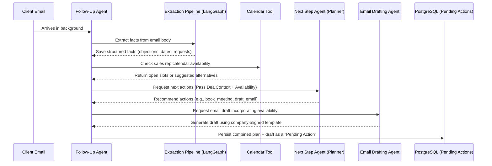

# AI-Driven CRM Automation: Presentation Builder & Reference Guide

This document is a comprehensive guide to the AI Agent Layer built on top of the Twenty CRM. It is designed to provide another AI model with all the context, problem statements, system workflows, and agent specifications needed to build a premium presentation about this project.

---

## 1. The Core Problem: Unstructured Information Explosion & Rep Fatigue

### The Challenge
Modern sales representatives are drowning in unstructured data:
* **Email Inundation:** Inboxes are flooded with client requests, objections, follow-ups, and calendar invitations.
* **CRM Fragmentation:** Vital deal context is scattered across disparate tables, notes, tasks, opportunity fields, and communication threads.
* **Administrative Overhead:** Keeping up with manual data entry, timeline logging, stage updates, and email drafts is exhausting ("executing" administrative tasks rather than selling).
* **Deal Slippage:** With so much noise, critical signals (e.g., timeline pressure, lack of point of contact, budget concerns, or stale opportunities) go unnoticed, causing opportunities to stall or churn.

---

## 2. The Star: The Follow-Up Orchestrator
The **Orchestrator** is the central brain of this AI layer. It sits between the CRM backend and the specialized agents, eliminating manual data handling.

### Direct Data Retrieval (Reading)
* **The Pain Point:** Sales reps waste time clicking through history tabs, notes, and related contact profiles to understand a deal's current state.
* **The Solution:** The Orchestrator queries Postgres to compile a consolidated, multi-source **DealContext** (encompassing company profiles, contact details, deal stages, tasks, note history, and recent emails). It presents this unified narrative back to the user instantly, removing the need to hunt through files.

### Automated CRM Mutations (Writing via Deferred-Write)
* **The Pain Point:** Manually updating stages, setting reminders, creating tasks, and copying notes into the CRM is tedious and error-prone.
* **The Solution:** The Orchestrator uses a **Deferred-Write Pattern**.
  * The Orchestrator locates *exactly* where a change needs to happen (e.g., which opportunity, contact, or company is targeted).
  * It determines *what* needs to be updated or created (e.g., creating a follow-up task, scheduling a meeting, or drafting a check-in email).
  * Instead of writing directly to the database, it builds a pre-formed **Pending Action** containing the complete JSON payload (e.g., email draft, task details, note body).
  * The sales representative is presented with this action in a clean UI. With a single click ("Accept"), the CRM executes the change. The rep remains in full control while data entry is automated.

---

## 3. Background Workflows: The Follow-Up Agent
The **Follow-Up Agent** operates continuously in the background, reading incoming signals, checking user schedules, and preparing full workflows.

### Example Workflow: Meeting Request Routing
When a client sends an email asking for a meeting, the background flow executes automatically:

1. **Email Ingestion & Extraction:** The system monitors incoming emails. The extraction pipeline parses the text, extracts key entities (names, dates, money, products), identifies the target opportunity, and writes structured facts to the database.
2. **Calendar Availability Check:** The follow-up agent reads the sales rep's calendar. If the client suggested specific times, it verifies them. If the rep is busy or no times were proposed, it finds the next free business-hour slots.
3. **Planner Handoff:** The follow-up agent invokes the Next Step Agent (Planner) to determine what to do next based on the email content and deal stage.
4. **Draft Generation:** The agent passes the calendar slots and deal context to the **Email Drafting Agent**, which writes a personalized response.
5. **Pending Action Creation:** The entire package (the plan, the calendar slots, the drafted email) is saved as a single `PendingAction` row, waiting for the representative's review and approval.

---

## 4. The Knowledge Graph Architecture: Profile Extraction & Synthesis
The **Knowledge Graph** acts as the memory and context layer for the AI agents, built around active deal profile data. It comprises two distinct data flows:

### A. The Write Path: Extraction LangGraph
The write path is a state machine that extracts intelligence from inbound emails without exposing client PII.
* **Topology:**
  `resolve_context` ──► (ok?) ──► `extract` ──► END
* **Context Resolution:** The graph anchors on the sender's email address. It queries PostgreSQL to locate the corresponding person, company, open deals (candidates), and existing shadow entities. If no active deal candidate exists or the sender is unknown, the graph halts immediately to avoid hallucinated attributions (no LLM runs).
* **PII Masking (`ProfileMasker`):** Before calling the LLM, the system runs a local masking step. Sensitive details (contact names, email addresses, phone numbers) are substituted with session-stable tokens (e.g., `{{person_1}}`), while system IDs remain visible. This ensures user privacy during LLM inference.
* **LLM Extraction:** The LLM receives the masked text and known entities block. It resolves which candidate deal the message is about, and extracts:
  * **Facts:** Key information, objections, budget constraints, or competitor mentions.
  * **Relationships:** Who works with whom, stances (e.g., champion vs. skeptic), and influence levels.
  * **Unknown Persons:** New leads or stakeholders mentioned in threads who aren't in the CRM.
* **Post-Extraction Unmasking:** The extracted text fields are restored (unmasked) using the session tokens before the Orchestrator writes the final facts, relationships, and shadow entities back to PostgreSQL.

### B. The Read Path: Profile Synthesis & Deal Context
When an agent or the user needs deal intelligence, the system compiles the current graph state into a unified package.
* **Aggregated Context Loading:** The `ProfileService` loads the opportunity info, company facts, contact summaries (with non-superseded facts), relationship maps, active shadow entities (those with at least 2 mentions), and the latest deal risk score.
* **Briefing Synthesis:** The synthesis engine triggers a single-shot LLM prompt to generate a 1–3 paragraph narrative summarizing:
  * Deal trajectory and velocity.
  * Stances of primary contacts (champions, decision-makers, blockers).
  * Major unresolved risks, objections, and next steps.
  * Competitor activity and calendar summary.
* **The `DealContext` Object:** The narrative and structured details are packed into a JSON-safe `DealContext` object, which is used by the Orchestrator, Planner, and Email Drafter to make informed plans and write tailored communications.

---

## 5. Next Step Agent (The Planner)
The Next Step Agent is a single-responsibility planning agent that reviews a deal and recommends **up to 5 prioritized actions** (e.g., `create_task`, `schedule_meeting`, `send_email`, `update_opportunity`, `log_activity`, `create_reminder`).

### Dynamic, Uploadable Playbooks ("Skills")
Rather than relying on hardcoded logic, the planner's behavior is fully customizable by the user:
* **The Skill Store (`core.skill`):** Sales managers can upload custom playbooks, stage-by-stage instructions, BANT qualification guidelines, or best practices in Markdown via the CRM UI.
* **Stable Naming Conventions:** Skills are saved with prefixes like `followup-planner-`, `followup-playbook-`, or `followup-bant`.
* **Runtime Discovery:** When evaluating a deal, the planner fetches the custom playbooks matching the opportunity's stage and adjusts its prioritization and recommendations to follow those exact guidelines.

---

## 6. Email & Proposal Drafting Agent
The Email Drafting Agent generates outreach communications aligned with the planned next steps.

### Custom Templates Over Generic Text
* **The Problem:** Generic AI templates sound robotic and ignore company-specific voice, product offerings, or brand guidelines.
* **The Solution:** The drafting agent integrates with the **Skill Store** via a `FileRetriever`.
  * It pulls company-defined templates matching prefixes like `followup-email-template-` or `followup-proposal-template-` (falling back to bundled markdown files only if none are configured).
  * It incorporates product/service catalog snippets relevant to the customer's industry.
  * It weaves in the calendar slots discovered during the background check.
  * It references the original inbound message if replying.
  * The result is a draft that reads like it was written by the company's best representative.

---

## 7. The Risk Agent: Reverse Lead Scoring
While traditional lead scoring measures how likely a deal is to close, the **Risk Agent** acts as a reverse lead scorer. It identifies why an active deal might fail.

### Real-Time Deal Risk Evaluation
The Risk Agent loads opportunity details, profile facts, stakeholder relationships, notes, tasks, and recent messages directly from the database to answer: *Given this opportunity, what is the current risk level and why?*
* **Risk Score:** A normalized value from `0.0` to `1.0`.
* **Risk Level:** Categorized as `low`, `medium`, or `high`.
* **Risk Factors:** Categorized list of indicators, such as:
  * `engagement_gap`: No recent activity or updates.
  * `close_date_pressure`: Close date is overdue or too close.
  * `deal_velocity_drop`: Opportunity is stuck in stages like proposal or meeting.
  * `missing_stakeholder`: No owner, no point of contact, or no champion.
  * `unresolved_objection`: Extracted facts flag legal, budget, timeline, or security hurdles.
  * `sentiment_decline`: Negative sentiment detected in communication logs.
  * `missing_next_step`: No active tasks scheduled.
* **Notification Recommendation:** Flagging whether the rep should be immediately alerted.

### The Daily Sweep
* A standalone background scheduler runs the Risk Agent across all active opportunities every morning (e.g., at 06:00).
* It monitors daily changes. If an opportunity crosses a risk threshold (e.g., shifting from `low` to `medium` or `high`), it creates a `risk_alert` in the pending actions table.
* **Deduplication:** The sweep prevents alert fatigue by checking if an active `risk_alert` already exists for the opportunity, skipping duplicate creations if the score remains unchanged.
* This alerts the Follow-Up Agent to prepare remediation plans (e.g., re-engagement draft, calendar slots search) to win the client back.

---

## 8. Presentation Structuring Ideas

When preparing slides or a speech from this document, structure the narrative as follows:

| Section | Topic / Slide Title | Key Takeaway |
| :--- | :--- | :--- |
| **Intro** | The CRM Data Explosion | Sales reps spend more time managing email & entering data than actually selling. |
| **Core Concept** | The Star: Follow-Up Orchestrator | A unified center that simplifies reading CRM summaries and automates writing via a review-and-accept model. |
| **Data Memory** | The Knowledge Graph | Dual write-path (LangGraph extraction + PII masking) and read-path (narrative synthesis & DealContext) system. |
| **Workflow** | Background Operations in Action | Walk through the background flow of an email arriving -> checking calendar -> generating an email draft with slots. |
| **Customization** | User-Configurable Skills & Playbooks | Show how sales managers upload markdown files in the UI to dictate planner behavior and email formatting. |
| **Safety Net** | The Risk Agent (Reverse Lead Scorer) | Explain how the daily risk sweep evaluates active deals and alerts reps when a deal is stalling. |
| **Conclusion** | Humans in the Loop, AI in the Background | The agent layer takes care of administrative tasks, leaving the representative with the final decision. |
