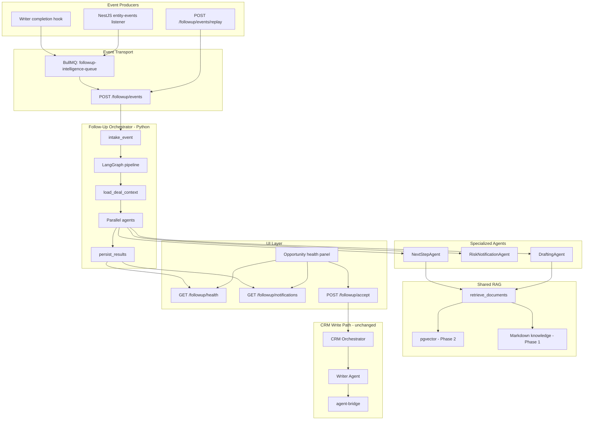
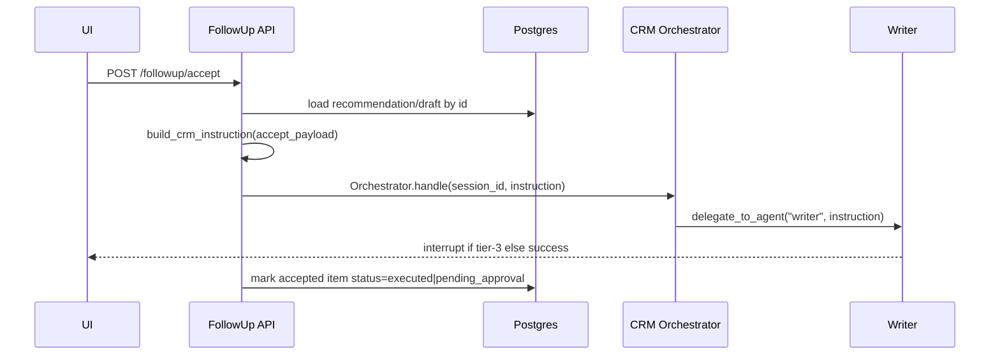
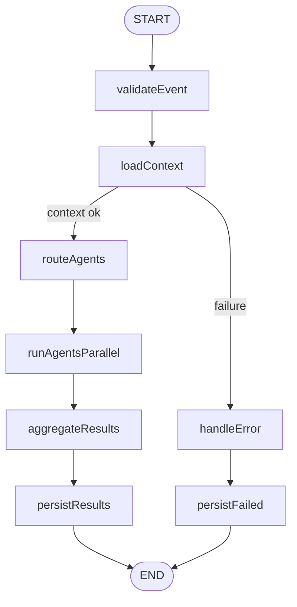
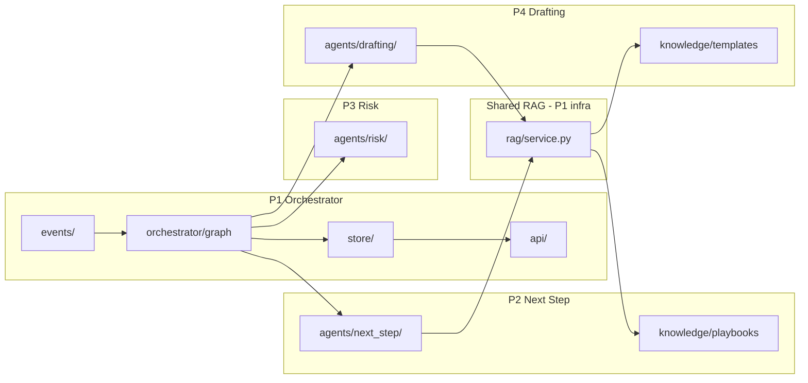

# Follow-Up Intelligence Layer — Implementation Plan

> **Team doc (VS Code / Git)** — read this file in the repo. Also on Notion:
> [Full Implementation Plan](https://app.notion.com/p/37d5a414128c81dcb0f2dc8454220789) ·
> [Concepts & Scenarios](https://app.notion.com/p/37d5a414128c81b2add7fc1e73769ae2) ·
> [P1](https://app.notion.com/p/37d5a414128c81bcabb0ef0df168b9a1) ·
> [P2](https://app.notion.com/p/37d5a414128c8168a556dae8d0a6d4f2) ·
> [P3](https://app.notion.com/p/37d5a414128c8189aadaca9de7cd0710) ·
> [P4](https://app.notion.com/p/37d5a414128c81298d2bda92f57065e3)

## Quick navigation

| Person | Jump to section | Role |
|--------|-----------------|------|
| **P1** | [Person 1 — Follow-Up Orchestrator](#person-1--follow-up-orchestrator) | LangGraph pipeline, events, API, store |
| **P2** | [Person 2 — Next Step Agent](#person-2--next-step-intelligence-agent) | Recommendations + playbooks |
| **P3** | [Person 3 — Risk Agent](#person-3--risk-scoring--notification-agent) | Risk score + notifications |
| **P4** | [Person 4 — Drafting + UI](#person-4--drafting-agent--ui) | Email/proposal drafts + React panel |

> **How to use this doc:** Each developer should jump to their section (**Person 1–4**). Section A explains what you own in plain language. Section B is a **copy-paste Cursor prompt** — paste it into a new Cursor chat to generate your code correctly.

---

## Shared Context (read once, all 4 people)

**Repo:** `packages/twenty-ai-service/` (Python) + `packages/twenty-server/` (NestJS) + `packages/twenty-front/` (React)

**Hard rule:** The Follow-Up layer **never writes to CRM**. It only analyzes, scores, recommends, notifies, and drafts. CRM writes always go: `User accepts → CRM Orchestrator → Writer Agent → agent-bridge`.

**How the 4 pieces connect:**

```text
CRM change → Event → [P1 Orchestrator] → loads DealContext
                              ↓
              ┌───────────────┼───────────────┐
              ↓               ↓               ↓
         [P2 Next Step]  [P3 Risk]     [P4 Drafting]
              └───────────────┼───────────────┘
                              ↓
                    [P1 saves to DB + API]
                              ↓
                    [P4 UI shows results]
                              ↓
              User accepts → [P1/P4] → CRM Orchestrator
```

**Contracts frozen by end of Week 1 (P1 publishes, others import):**

- `followup/context/schemas.py` → `DealContext`
- `followup/events/schemas.py` → `FollowUpEvent`
- `followup/schemas/agents.py` → agent result models
- `followup/rag/service.py` → `RetrievalService.retrieve_documents(query, collection, top_k)`

---

# Person 1 — Follow-Up Orchestrator

## A. What you own and what it does

You build the **central brain** of the Follow-Up system. You do **not** build the three intelligence agents — you **call** them.

**Your orchestrator:**

1. Receives a CRM event (`opportunity_stage_changed`, `meeting_completed`, etc.)
2. Validates and deduplicates it
3. Loads full deal context from CRM (read-only via existing bridge tools)
4. Decides which agents to run (routing table)
5. Runs P2, P3, P4 agents **in parallel**
6. Aggregates their outputs
7. Saves everything to Postgres
8. Exposes REST API for the UI
9. On user "Accept", forwards the action to the **existing CRM Orchestrator** (never writes CRM yourself)

**You also own:** NestJS event listener + BullMQ queue that forwards CRM DB changes to your Python service, the Writer completion hook, shared RAG infrastructure skeleton, and Postgres tables.

**LangGraph:** Your pipeline is a LangGraph `StateGraph` with nodes: validate → load context → route → run agents → aggregate → persist.

---

## B. Cursor implementation prompt (copy-paste)

```text
You are implementing Person 1's Follow-Up Orchestrator for the Twenty CRM capstone.

## Goal
Build the event-driven Follow-Up Orchestrator in packages/twenty-ai-service/followup/.
It NEVER writes to CRM. It orchestrates three agents (next_step, risk, drafting) via LangGraph.

## Existing code to reuse (read these first)
- packages/twenty-ai-service/agent/tools/composite_reads.py — get_entity_timeline, get_company_overview, get_related_entities
- packages/twenty-ai-service/agent/workers/writer_graph.py — LangGraph StateGraph pattern
- packages/twenty-ai-service/agent/workers/writer_worker.py — hook after Writer success
- packages/twenty-ai-service/main.py — mount new router
- packages/twenty-server/src/engine/api/graphql/workspace-query-runner/listeners/entity-events-to-db.listener.ts — event fan-out pattern
- packages/twenty-server/src/engine/core-modules/message-queue/message-queue.constants.ts — add new queue

## Files to create

### Python — followup/
followup/__init__.py
followup/events/schemas.py          # FollowUpEvent, FollowUpEventType, payloads, IntakeResult
followup/events/intake.py           # async def intake_event(event) -> IntakeResult
followup/events/dedup.py            # async def is_duplicate(idempotency_key) -> bool
followup/context/schemas.py         # DealContext, EngagementMetrics, TimelineItem
followup/context/loader.py          # async def load_deal_context(opportunity_id, workspace_id, user_id) -> DealContext
followup/context/enrich.py          # def enrich_context(context: DealContext) -> DealContext
followup/orchestrator/state.py      # FollowUpState TypedDict
followup/orchestrator/routing.py    # EVENT_AGENT_ROUTING dict
followup/orchestrator/nodes.py      # validate_event, load_context, route_agents, run_agents_parallel, aggregate_results, persist_results, handle_error
followup/orchestrator/graph.py      # def build_followup_graph() -> CompiledGraph
followup/orchestrator/runner.py     # async def run_followup_pipeline(event: FollowUpEvent) -> FollowUpRunResult
followup/schemas/agents.py          # NextStepAgentResult, RiskNotificationAgentResult, DraftingAgentResult (import from agent modules)
followup/schemas/persistence.py     # FollowUpRunResult, OpportunityHealthSummary
followup/schemas/api.py             # AcceptFollowUpRequest, AcceptFollowUpResponse
followup/store/repository.py        # save_*, get_opportunity_health, list_notifications, update_notification_status
followup/store/models.py            # SQL table definitions or raw SQL
followup/rag/service.py             # class RetrievalService(Protocol): retrieve_documents(query, collection, top_k) -> list[RetrievedChunk]
followup/rag/file_retriever.py      # Phase 1 keyword/file retriever
followup/rag/collections.py         # CollectionName enum
followup/api/router.py              # FastAPI APIRouter prefix=/followup
followup/api/routes_events.py       # POST /followup/events → 202
followup/api/routes_health.py       # GET /followup/health/{opportunity_id}
followup/api/routes_notifications.py # GET/PATCH notifications
followup/api/routes_accept.py       # POST /followup/accept → CRM Orchestrator
followup/tests/test_intake.py
followup/tests/test_graph.py
followup/tests/fixtures/deal_context.json

### NestJS — twenty-server
src/engine/metadata-modules/followup-intelligence/followup-intelligence.module.ts
src/engine/metadata-modules/followup-intelligence/services/followup-event-emitter.service.ts
src/engine/metadata-modules/followup-intelligence/jobs/process-followup-event.job.ts
src/engine/metadata-modules/followup-intelligence/listeners/followup-intelligence.listener.ts

### Hook
Modify agent/workers/writer_worker.py — after successful write, call emit_followup_event_from_writer()

## Key function signatures

async def intake_event(event: FollowUpEvent) -> IntakeResult
async def load_deal_context(opportunity_id: str, workspace_id: str, user_id: str) -> DealContext
async def run_followup_pipeline(event: FollowUpEvent) -> FollowUpRunResult
def build_crm_instruction(accept_payload: AcceptFollowUpRequest) -> str
async def dispatch_to_crm_orchestrator(session_id: str, instruction: str) -> dict

## LangGraph nodes (orchestrator/nodes.py)

1. validate_event(state) — Pydantic validate, dedup via dedup.py, set run_id
2. load_context(state) — call load_deal_context; on failure set status=failed
3. route_agents(state) — set agents_to_run from EVENT_AGENT_ROUTING[event.event_type]
4. run_agents_parallel(state) — asyncio.gather with return_exceptions=True:
   - if "next_step" in agents_to_run: from followup.agents.next_step.agent import run_next_step_agent
   - if "risk" in agents_to_run: from followup.agents.risk.agent import run_risk_notification_agent
   - if "drafting" in agents_to_run: from followup.agents.drafting.agent import run_drafting_agent
   Use MOCK implementations until P2/P3/P4 land; mock returns fixture data from tests/fixtures/
5. aggregate_results(state) — merge into FollowUpRunResult; status=completed|partial
6. persist_results(state) — call store.repository save_* for each agent output
7. handle_error(state) — persist failed run

## EVENT_AGENT_ROUTING
opportunity_created → [next_step, risk]
opportunity_updated → [risk]
opportunity_stage_changed → [next_step, risk, drafting]
meeting_completed → [next_step, drafting]
email_sent → [risk]
proposal_sent → [drafting, risk]
task_completed → [risk]
activity_logged → [risk]

## Postgres tables (store/models.py)
followup_events(id, idempotency_key UNIQUE, event_type, opportunity_id, workspace_id, status, payload JSONB, created_at)
followup_runs(id, event_id, status, started_at, completed_at)
followup_recommendations(id, run_id, opportunity_id, recommended_actions JSONB, summary_reasoning, confidence)
followup_risk_scores(id, run_id, opportunity_id, score, level, factors JSONB, reasoning_summary)
followup_notifications(id, run_id, opportunity_id, user_id, title, body, severity, status, reasoning_summary)
followup_drafts(id, run_id, opportunity_id, draft_type, content JSONB, quality_score, reasoning)

## API endpoints
POST /followup/events — body: FollowUpEvent → 202 {run_id, status: "accepted"}; background task runs pipeline
GET /followup/health/{opportunity_id} → OpportunityHealthSummary
GET /followup/notifications?user_id=&status=unread
PATCH /followup/notifications/{id} — body: {status: "read"|"dismissed"}
POST /followup/accept — body: AcceptFollowUpRequest → calls POST /agent/chat on same service

## NestJS job
ProcessFollowUpEventJob: dequeue FollowUpEvent payload → POST {AI_SERVICE_URL}/followup/events
Add followupIntelligenceQueue to MessageQueue enum. retryLimit: 3.

## DealContext schema (publish for P2/P3/P4)
DealContext:
  opportunity: {id, name, stage, amount, close_date, company_id, owner_id, updated_at}
  company: {id, name, industry} | null
  contacts: list[{id, name, role, is_decision_maker}]
  timeline: list[{type, title, summary, occurred_at}]  # notes, tasks, meetings merged
  tasks: list[{id, title, status, due_at, is_overdue}]
  meetings: list[{id, title, starts_at, status}]
  pipeline_meta: {stages: list[str], stage_sla_days: dict[str, int]}
  engagement: {days_since_last_activity, activity_count_14d, activity_count_prior_14d, has_future_meeting}

## Week 1 deliverable
- POST /followup/events accepts event, runs graph with MOCK agents, persists run row
- DealContext + FollowUpEvent schemas committed
- RetrievalService protocol + file_retriever stub
- Mount router in main.py

## Constraints
- No CRM write tools in followup/ package
- Use existing bridge_client.forward for reads only (Reader role env vars)
- Match code style: async Python, Pydantic v2, no abbreviations in variable names
- Do not implement agent logic — only import and call agent entry functions
```

### P1 — Implementation order


| Step | Task                                       | Done when                            |
| ---- | ------------------------------------------ | ------------------------------------ |
| 1    | `events/schemas.py` + `context/schemas.py` | P2/P3/P4 can import types            |
| 2    | `context/loader.py` using composite_reads  | Returns real DealContext from bridge |
| 3    | `store/` + migrations                      | Tables exist                         |
| 4    | `orchestrator/` LangGraph with mock agents | Pipeline runs end-to-end             |
| 5    | `api/routes_*.py` + mount in `main.py`     | REST works                           |
| 6    | NestJS listener + BullMQ job               | UI CRM change triggers event         |
| 7    | Writer hook                                | Agent chat write triggers event      |
| 8    | Replace mocks as P2/P3/P4 merge            | Real intelligence in pipeline        |


---

# Person 2 — Next Step Intelligence Agent

## A. What you own and what it does

You build the agent that answers: **"What should the sales rep do next on this deal?"**

It does **not** execute actions. It returns 1–3 ranked recommendations, each with clear **reasoning** and evidence from the deal history.

**When it runs:** `opportunity_created`, `opportunity_stage_changed`, `meeting_completed`

**How it thinks:**

1. Reads the deal context (stage, timeline, engagement, contacts)
2. Retrieves relevant sales playbooks, BANT framework, and best practices via RAG
3. Calls the LLM once with a structured JSON prompt
4. Scores and ranks recommended actions (schedule demo, send proposal, qualify budget, etc.)
5. Returns `NextStepAgentResult` to P1's orchestrator

**You also own:** Sales knowledge content in `followup/knowledge/playbooks/` and `bant.md`. You consume `RetrievalService` from P1 — you do not build vector DB infra.

---

## B. Cursor implementation prompt (copy-paste)

```text
You are implementing Person 2's Next Step Intelligence Agent for the Twenty CRM capstone.

## Goal
Build followup/agents/next_step/ — recommends 1-3 next actions for a sales rep with reasoning.
NEVER writes to CRM. Single LLM JSON call per run (no tool loop in v1).

## Dependencies (import from P1 — do not redefine)
- followup/context/schemas.py → DealContext
- followup/events/schemas.py → FollowUpEvent, FollowUpEventType
- followup/rag/service.py → RetrievalService, RetrievedChunk
- followup/rag/collections.py → CollectionName

## Files to create
followup/agents/next_step/__init__.py
followup/agents/next_step/schemas.py       # RecommendedAction, NextStepAgentResult, NextStepLLMOutput
followup/agents/next_step/prompts.py       # build_next_step_prompt(context, chunks) -> str
followup/agents/next_step/scoring.py     # score_recommendations(actions, context) -> list[RecommendedAction]
followup/agents/next_step/agent.py         # run_next_step_agent — main entry
followup/agents/next_step/retrieval.py     # select_playbook_chunks, retrieve_bant_framework
followup/knowledge/playbooks/Discovery.md
followup/knowledge/playbooks/Proposal.md
followup/knowledge/playbooks/Negotiation.md
followup/knowledge/playbooks/Closed.md
followup/knowledge/bant.md
followup/knowledge/best_practices.md
followup/tests/test_next_step_agent.py
followup/tests/fixtures/next_step_context_discovery.json
followup/tests/fixtures/next_step_context_proposal.json

## Main entry function (agent.py)

async def run_next_step_agent(
    context: DealContext,
    event: FollowUpEvent,
    retrieval: RetrievalService,
) -> NextStepAgentResult:

## Logic flow
1. if should_skip(context, event): return NextStepAgentResult(skipped=True, skip_reason=..., recommended_actions=[], summary_reasoning="", confidence=0)
   Skip when: stage in [Closed Won, Closed Lost]; no company linked; event_type not in [opportunity_created, opportunity_stage_changed, meeting_completed]
2. chunks = await select_playbook_chunks(context.opportunity.stage, event.event_type, retrieval)
3. bant_chunks = await retrieve_bant_framework(retrieval)
4. all_chunks = chunks + bant_chunks (top 5 total)
5. prompt = build_next_step_prompt(context, all_chunks)
6. llm_output = await call_llm_json(prompt, schema=NextStepLLMOutput)  # reuse agent/llm_client.py pattern
7. actions = score_recommendations(llm_output.actions, context)
8. for each action: attach reasoning + evidence[] citing timeline items or playbook chunks
9. return NextStepAgentResult(recommended_actions=actions, summary_reasoning=..., confidence=..., skipped=False)

## RecommendedAction schema (schemas.py)
RecommendedAction:
  action_type: str          # e.g. "schedule_demo", "send_proposal", "qualify_budget", "create_task", "schedule_meeting"
  title: str
  description: str
  priority: int             # 1-5, 1 = highest
  reasoning: str           # REQUIRED — why this action now
  evidence: list[str]       # e.g. ["No activity in 8 days", "Playbook: Discovery requires demo before Proposal"]
  suggested_crm_instruction: str  # natural language for Writer if user accepts, e.g. "Create a task on opportunity {id}: Schedule product demo with decision maker"

## NextStepAgentResult schema
recommended_actions: list[RecommendedAction]
summary_reasoning: str
confidence: float         # 0.0-1.0
skipped: bool
skip_reason: str | None

## retrieval.py
async def select_playbook_chunks(stage: str, event_type: FollowUpEventType, retrieval: RetrievalService) -> list[RetrievedChunk]:
    # query RetrievalService with collection=sales_playbooks, query=f"{stage} {event_type}"
async def retrieve_bant_framework(retrieval: RetrievalService) -> list[RetrievedChunk]:
    # collection=bant, query="BANT qualification"

## scoring.py (deterministic, no LLM)
def score_recommendations(actions: list[RecommendedAction], context: DealContext) -> list[RecommendedAction]:
    # Boost priority if: matches current stage, addresses engagement gap, references overdue task
    # Sort by priority ascending (1 first)
    # Return max 3 actions

## prompts.py
System: You are a sales coach. Given deal context and playbook excerpts, recommend 1-3 specific next actions.
Output JSON only matching NextStepLLMOutput schema.
Each action must reference specific deal facts.

## Knowledge files (create realistic content)
playbooks/Discovery.md — qualify BANT, schedule demo, identify decision maker
playbooks/Proposal.md — send proposal, confirm budget, set close date
playbooks/Negotiation.md — handle objections, executive sponsor, legal review
bant.md — Budget, Authority, Need, Timeline criteria per stage

## Tests (test_next_step_agent.py)
- Mock RetrievalService returning fixed chunks
- Mock LLM returning fixed JSON
- Test skip on Closed Won
- Test 3 actions returned for stage_changed Discovery → Proposal
- Test every action has non-empty reasoning
- Test suggested_crm_instruction contains opportunity id

## Constraints
- Do not import crm_tools or bridge_client — only use DealContext passed in
- Do not write to database — return model only; P1 persists
- Use agent/llm_client.py for LLM calls (read existing pattern)
```

### P2 — Implementation order


| Step | Task                        | Done when                                 |
| ---- | --------------------------- | ----------------------------------------- |
| 1    | Knowledge markdown files    | 4 playbooks + BANT exist                  |
| 2    | `schemas.py`                | Matches P1's `schemas/agents.py` contract |
| 3    | `retrieval.py`              | Works with P1's `RetrievalService`        |
| 4    | `prompts.py` + `scoring.py` | Unit tested without LLM                   |
| 5    | `agent.py`                  | `run_next_step_agent` passes all tests    |
| 6    | Integration                 | P1 unmocked import works in graph         |


---

# Person 3 — Risk Scoring & Notification Agent

## A. What you own and what it does

You build the agent that answers: **"Is this deal at risk, and should we alert the rep?"**

It combines **deterministic rules** (reliable, testable) with a small LLM call (only for notification wording).

**When it runs:** Almost every event type (see routing table). Most active on `opportunity_stage_changed`, `activity_logged`, `task_completed`.

**How it thinks:**

1. Scores deal health 0–100 using configurable rules (no activity, stalled stage, missing decision maker, etc.)
2. Detects specific risk signals
3. Optionally enriches with existing `deal_risk_report` read tool (read-only)
4. Decides if 0–2 notifications should fire (max 2 per run, no duplicates)
5. LLM writes notification body + reasoning summary; severity/title come from rules
6. Returns `RiskNotificationAgentResult` to P1

**You do not build the UI notification list** — P1 exposes API, P4 may build UI. You own the scoring logic and notification lifecycle rules.

---

## B. Cursor implementation prompt (copy-paste)

```text
You are implementing Person 3's Risk Scoring & Notification Agent for the Twenty CRM capstone.

## Goal
Build followup/agents/risk/ — computes deal risk score 0-100, generates 0-2 notifications.
NEVER writes to CRM. Rules are deterministic Python; LLM only for notification prose.

## Dependencies (import from P1)
- followup/context/schemas.py → DealContext
- followup/events/schemas.py → FollowUpEvent
- Optional read: packages/twenty-ai-service/agent/tools/workflows.py → deal_risk_report (read-only enrichment)

## Files to create
followup/agents/risk/__init__.py
followup/agents/risk/schemas.py          # RiskFactor, RiskScore, RiskScoreBreakdown, Notification, NotificationDraft, RiskNotificationAgentResult
followup/agents/risk/rules.py            # compute_risk_score, detect_risk_signals, RULES config
followup/agents/risk/notifications.py    # should_notify, generate_notification_copy, apply_notification_lifecycle
followup/agents/risk/agent.py            # run_risk_notification_agent — main entry
followup/tests/test_risk_agent.py
followup/tests/fixtures/risk_context_stale.json
followup/tests/fixtures/risk_context_healthy.json

## Main entry function (agent.py)

async def run_risk_notification_agent(
    context: DealContext,
    event: FollowUpEvent,
    existing_notifications: list[Notification],
) -> RiskNotificationAgentResult:

## Logic flow
1. breakdown = compute_risk_score(context)  # rules.py — deterministic
2. signals = detect_risk_signals(context)     # rules.py — list of RiskFactor
3. optional: merge deal_risk_report signals if available (try/except, non-blocking)
4. risk_score = RiskScore(score=breakdown.total, level=breakdown.level, factors=signals, computed_at=now, reasoning_summary="")
5. drafts = should_notify(breakdown, event, existing_notifications)  # 0-2 NotificationDraft
6. notifications = await generate_notification_copy(drafts, context)  # LLM for body only
7. notifications = apply_notification_lifecycle(notifications, existing_notifications)
8. risk_score.reasoning_summary = build_reasoning_summary(signals)
9. return RiskNotificationAgentResult(risk_score=risk_score, notifications=notifications, reasoning_summary=risk_score.reasoning_summary)

## Risk rules (rules.py) — configurable list

RULE_DEFINITIONS = [
  {"id": "no_activity_7d", "points": 25, "condition": lambda ctx: ctx.engagement.days_since_last_activity >= 7},
  {"id": "no_future_meeting", "points": 20, "condition": lambda ctx: not ctx.engagement.has_future_meeting and ctx.opportunity.stage not in ["Closed Won", "Closed Lost"]},
  {"id": "stalled_stage", "points": 20, "condition": lambda ctx: days_in_stage(ctx) > ctx.pipeline_meta.stage_sla_days.get(ctx.opportunity.stage, 14)},
  {"id": "missing_decision_maker", "points": 15, "condition": lambda ctx: stage_past_discovery(ctx) and not any(c.is_decision_maker for c in ctx.contacts)},
  {"id": "missing_proposal", "points": 20, "condition": lambda ctx: stage_at_or_past_proposal(ctx) and not has_proposal_evidence(ctx)},
  {"id": "overdue_tasks", "points": 15, "condition": lambda ctx: any(t.is_overdue for t in ctx.tasks)},
  {"id": "engagement_drop", "points": 10, "condition": lambda ctx: ctx.engagement.activity_count_prior_14d > 0 and ctx.engagement.activity_count_14d < ctx.engagement.activity_count_prior_14d * 0.5},
]
# Cap total at 100
# level: LOW 0-39, MEDIUM 40-69, HIGH 70+

def compute_risk_score(context: DealContext) -> RiskScoreBreakdown:
    # Apply each rule, collect triggered RiskFactor list, sum points min(100)

## Notification logic (notifications.py)

def should_notify(breakdown, event, existing) -> list[NotificationDraft]:
    # Emit notification if: score >= 40 OR any HIGH severity factor
    # Max 2 drafts per run
    # Do not re-notify same rule_id if dismissed in existing within 7 days
    # Map rule_id → {title, severity, template_key}

async def generate_notification_copy(drafts, context) -> list[Notification]:
    # LLM prompt: given draft title + severity + deal facts, write 2-3 sentence body + reasoning_summary
    # title and severity from rules — LLM does NOT change severity

def apply_notification_lifecycle(new_notifications, existing) -> list[Notification]:
    # Dedupe by (opportunity_id, rule_id)
    # Set status="unread" for new
    # Return only new notifications to persist

## Notification schema
Notification:
  id: str | None           # P1 assigns on persist
  opportunity_id: str
  user_id: str
  title: str
  body: str
  severity: Literal["low", "medium", "high"]
  status: Literal["unread", "read", "dismissed", "acted_on"]
  rule_id: str
  reasoning_summary: str  # REQUIRED

## Tests — 10 scenarios (test_risk_agent.py)
1. Healthy deal → score < 40, 0 notifications
2. No activity 10 days → +25, notification if >= 40
3. Stalled stage → +20
4. Missing decision maker past Discovery → +15
5. Overdue tasks → +15
6. Multiple rules stack capped at 100 → HIGH
7. Dismissed notification not re-sent within 7 days
8. Max 2 notifications when 5 rules fire
9. Closed Won → score still computed but should_notify returns []
10. LLM failure → fallback body from template string

## Constraints
- No CRM writes
- No database calls in agent — existing_notifications passed in by P1
- Rules must be pure functions of DealContext
- Every notification has reasoning_summary
```

### P3 — Implementation order


| Step | Task                                  | Done when                                         |
| ---- | ------------------------------------- | ------------------------------------------------- |
| 1    | `rules.py` + pure rule helpers        | 10 unit tests pass without LLM                    |
| 2    | `schemas.py`                          | Matches P1 contract                               |
| 3    | `notifications.py` lifecycle + dedupe | Dedupe tests pass                                 |
| 4    | `agent.py` with LLM copy generation   | Full agent tests pass                             |
| 5    | Integration                           | P1 graph calls real `run_risk_notification_agent` |


---

# Person 4 — Drafting Agent + UI

## A. What you own and what it does

You build the agent that answers: **"Can you draft the follow-up email or proposal for me?"**

It generates **ready-to-review content** — not sent emails. The rep copies, edits, or accepts to create a CRM note via the Writer.

**When it runs:** `opportunity_stage_changed`, `meeting_completed`, `proposal_sent`, and when risk is HIGH (re-engagement email).

**Draft types you support (v1):**

- Follow-up email
- Meeting recap email
- Proposal delivery email (phase 2)
- Product/service proposal outline (phase 2)
- Re-engagement email (when risk HIGH)

**You also own (with P1):**

- `POST /followup/accept` helper logic (`build_crm_instruction` for drafts)
- **Frontend UI:** Opportunity health panel, recommendation cards, draft preview, notification list

---

## B. Cursor implementation prompt (copy-paste)

```text
You are implementing Person 4's Drafting Agent + Follow-Up UI for the Twenty CRM capstone.

## Goal
Part A: followup/agents/drafting/ — generates email and proposal drafts with quality scoring.
Part B: twenty-front followup-intelligence module — displays health, recommendations, risk, drafts, notifications.
NEVER writes to CRM from drafting agent. Accept flow routes through CRM Orchestrator.

## Dependencies
- followup/context/schemas.py → DealContext
- followup/events/schemas.py → FollowUpEvent
- followup/agents/risk/schemas.py → RiskScore (for re-engagement trigger)
- followup/rag/service.py → RetrievalService
- packages/twenty-server/.../agent-orchestrator-client.service.ts — accept → /agent/chat pattern

## Part A — Python files

followup/agents/drafting/__init__.py
followup/agents/drafting/schemas.py      # DraftType enum, EmailDraft, ProposalDraft, DraftingAgentResult
followup/agents/drafting/agent.py        # run_drafting_agent
followup/agents/drafting/prompts.py      # build_draft_prompt
followup/agents/drafting/quality.py      # score_draft_quality
followup/agents/drafting/resolver.py     # resolve_draft_types
followup/knowledge/email_templates/follow_up.md
followup/knowledge/email_templates/meeting_recap.md
followup/knowledge/email_templates/re_engagement.md
followup/knowledge/proposal_templates/product_proposal.md
followup/knowledge/proposal_templates/service_proposal.md
followup/tests/test_drafting_agent.py

## Main entry (agent.py)

async def run_drafting_agent(
    context: DealContext,
    event: FollowUpEvent,
    draft_types: list[DraftType] | None,
    retrieval: RetrievalService,
    risk_score: RiskScore | None = None,
) -> DraftingAgentResult:

## Logic flow
1. types = draft_types or resolve_draft_types(event, context, risk_score)
2. if not types: return DraftingAgentResult(email_drafts=[], proposal_drafts=[], reasoning="No drafts needed", skipped=True)
3. Cap: max 1 email + 1 proposal per run
4. For each type:
   a. template = await get_template(type, retrieval)  # from email_templates or proposal_templates collection
   b. catalog = await get_product_catalog_snippets(context.company.industry, retrieval) if proposal type
   c. prompt = build_draft_prompt(context, template, catalog, type)
   d. draft = await call_llm_json(prompt, schema=EmailDraft or ProposalDraft)
   e. draft.quality_score = score_draft_quality(draft, context)
   f. draft.reasoning = explain_draft_choices(draft, context)
5. return DraftingAgentResult(email_drafts=[...], proposal_drafts=[...], reasoning=summary)

## resolve_draft_types (resolver.py)
opportunity_stage_changed + stage >= Proposal → [product_proposal] or [follow_up_email]
meeting_completed → [meeting_recap]
proposal_sent → [follow_up_email]  # proposal delivery
risk_score.level == HIGH → [re_engagement_email]
Default for stage_changed → [follow_up_email]
Max 2 types, priority: meeting_recap > re_engagement > follow_up > proposal

## EmailDraft schema
subject: str
body: str                   # plain text or markdown
draft_type: DraftType
template_used: str
quality_score: float        # 0-1
reasoning: str              # REQUIRED

## ProposalDraft schema
title: str
sections: list[{heading: str, content: str}]
draft_type: DraftType
quality_score: float
reasoning: str

## score_draft_quality (quality.py) — deterministic checks
+0.2 has subject/title
+0.2 mentions company or contact name
+0.2 references deal stage or recent meeting
+0.2 body length 100-800 words
+0.2 no placeholder brackets like [INSERT NAME] remaining
Cap at 1.0

## Accept flow helper (coordinate with P1 — can live in followup/api/accept_builder.py)

def build_crm_instruction_for_draft(draft: EmailDraft | ProposalDraft, opportunity_id: str) -> str:
    if EmailDraft: return f"Create a note on opportunity {opportunity_id} with this draft email:\nSubject: {draft.subject}\n\n{draft.body}"
    if ProposalDraft: return f"Create a note on opportunity {opportunity_id} with this proposal draft:\n{format_sections(draft)}"

def build_crm_instruction_for_recommendation(action: RecommendedAction, opportunity_id: str) -> str:
    return action.suggested_crm_instruction or f"On opportunity {opportunity_id}: {action.description}"

## Part B — Frontend (twenty-front)

packages/twenty-front/src/modules/followup-intelligence/
  components/opportunity-health-panel.component.tsx
  components/recommendation-card.component.tsx
  components/risk-score-badge.component.tsx
  components/draft-preview.component.tsx
  components/notification-list.component.tsx
  hooks/use-opportunity-health.ts
  hooks/use-followup-notifications.ts
  services/followup-api.service.ts
  types/followup-health.type.ts

## useOpportunityHealth(opportunityId)
- Poll GET {AI_SERVICE_URL}/followup/health/{opportunityId} every 30s
- Return { recommendations, riskScore, drafts, notifications, isLoading, error }

## OpportunityHealthPanel
- Show risk badge (green/amber/red)
- List RecommendationCard for each recommended_action (title, reasoning, Accept button)
- DraftPreview with copy-to-clipboard + Accept
- Link to full notification list

## Accept button handler
POST /followup/accept with body:
  { accept_type: "recommendation"|"email_draft"|"proposal_draft", item_id, opportunity_id, session_id: agentChatThreadId }
- If response contains interrupt → show existing write-confirmation UI (reuse agent chat patterns)
- On success → refresh health

## UI constraints
- Use Linaria styled components (match twenty-front patterns)
- Named exports only, functional components
- Jotai for local UI state if needed
- No GraphQL required v1 — REST to AI service

## Tests
test_drafting_agent.py:
- meeting_completed → meeting_recap email generated
- stage_changed Proposal → proposal draft generated
- quality_score > 0.5 for complete fixture
- reasoning non-empty
- max 1 email + 1 proposal per run
```

### P4 — Implementation order


| Step | Task                                 | Done when                         |
| ---- | ------------------------------------ | --------------------------------- |
| 1    | Email templates + proposal templates | Knowledge files exist             |
| 2    | `resolver.py` + `schemas.py`         | Draft type routing tested         |
| 3    | `agent.py` + `quality.py`            | Agent tests pass                  |
| 4    | `accept_builder.py` (with P1)        | Instructions format verified      |
| 5    | `followup-api.service.ts` + hooks    | API client works                  |
| 6    | `OpportunityHealthPanel`             | Displays health from API          |
| 7    | Accept button e2e                    | Creates CRM note via Orchestrator |


---

## Context: What Exists Today


| Component             | Location                                                                                                                                                                       | Status                                                      |
| --------------------- | ------------------------------------------------------------------------------------------------------------------------------------------------------------------------------ | ----------------------------------------------------------- |
| CRM Orchestrator      | `[packages/twenty-ai-service/agent/orchestrator.py](packages/twenty-ai-service/agent/orchestrator.py)`                                                                         | Built — delegates to reader/writer                          |
| Writer (LangGraph)    | `[packages/twenty-ai-service/agent/workers/writer_graph.py](packages/twenty-ai-service/agent/workers/writer_graph.py)`                                                         | Built — tier-3 `interrupt()` gate                           |
| Composite reads       | `[packages/twenty-ai-service/agent/tools/composite_reads.py](packages/twenty-ai-service/agent/tools/composite_reads.py)`                                                       | Built — `get_company_overview`, `get_entity_timeline`, etc. |
| Deal risk helper      | `[packages/twenty-ai-service/agent/tools/workflows.py](packages/twenty-ai-service/agent/tools/workflows.py)`                                                                   | Built — `deal_risk_report` (read-only)                      |
| CRM entity events     | `[packages/twenty-server/.../entity-events-to-db.listener.ts](packages/twenty-server/src/engine/api/graphql/workspace-query-runner/listeners/entity-events-to-db.listener.ts)` | Built — BullMQ fan-out on create/update                     |
| Follow-up stub        | `[packages/twenty-ai-service/agent/stubs/agent_stubs.py](packages/twenty-ai-service/agent/stubs/agent_stubs.py)`                                                               | Stub only                                                   |
| Prior simplified plan | `[packages/twenty-ai-service/FOLLOWUP_ORCHESTRATOR_PLAN.md](packages/twenty-ai-service/FOLLOWUP_ORCHESTRATOR_PLAN.md)`                                                         | Design doc — superseded by this plan                        |


**Hard constraint (unchanged):** Follow-Up Orchestrator **never** calls CRM write tools. All CRM mutations flow: `User approval → CRM Orchestrator → Writer Agent → agent-bridge`.

---

## 1. Architecture Overview

The Follow-Up Intelligence Layer is a **separate orchestration domain** inside `twenty-ai-service`, not a sub-agent of the CRM Orchestrator. It runs **proactively on CRM events** and **reactively on user chat** (optional v2) using the same agent library functions.




**Separation of concerns:**


| Layer                              | Responsibility                                  | Writes CRM?     |
| ---------------------------------- | ----------------------------------------------- | --------------- |
| CRM Orchestrator                   | User chat, planning, delegation                 | Via Writer only |
| Follow-Up Orchestrator             | Event intake, routing, aggregation, persistence | **Never**       |
| Next Step / Risk / Drafting agents | Analysis, scoring, content generation           | **Never**       |
| Shared RAG                         | Document retrieval                              | **Never**       |


**Two entry points, one agent library:**

1. **Event-driven (primary):** `FollowUpEvent` → LangGraph pipeline → store results
2. **Chat-driven (secondary, reuses agents):** CRM Orchestrator `delegate_to_agent("followup", ...)` calls the same `run_next_step_agent()` etc. without re-running the full graph

---

## 2. End-to-End Workflow

### 2.1 Proactive flow (event-driven)

1. Sales rep updates CRM (UI, import, or agent chat Writer action).
2. **Producer** emits a normalized `FollowUpEvent` with `event_id`, `event_type`, `opportunity_id`, `workspace_id`, `user_id`, `payload`.
3. Event lands on `followup-intelligence-queue` (BullMQ, Redis).
4. `ProcessFollowUpEventJob` (NestJS) POSTs to Python `POST /followup/events` (fire-and-forget from CRM request path; 202 Accepted).
5. **Follow-Up Orchestrator** (`run_followup_pipeline`):
  - Validates + deduplicates event (`idempotency_key = event_id`)
  - Loads `DealContext` via read-only composite tools (bridge, Reader role)
  - Routes to agents per `EVENT_AGENT_ROUTING` table
  - Runs eligible agents **in parallel** (`asyncio.gather`, `return_exceptions=True`)
  - Aggregates into `FollowUpRunResult`
  - Persists recommendations, risk scores, notifications, drafts
  - Marks event `status=completed` (or `partial` / `failed`)
6. UI polls `GET /followup/health/{opportunity_id}` and `GET /followup/notifications`.
7. Rep reviews suggestions; on accept → `POST /followup/accept` → CRM Orchestrator with pre-built instruction → Writer executes with existing tier gates.

### 2.2 Human approval flow




**Accept types:**


| `accept_type`    | CRM instruction template                                         | Writer action examples                       |
| ---------------- | ---------------------------------------------------------------- | -------------------------------------------- |
| `recommendation` | `"On opportunity {id}: {action_description}"`                    | create_task, update_opportunity, create_note |
| `email_draft`    | `"Create a note on opportunity {id} with this draft email: ..."` | create_note (v1)                             |
| `proposal_draft` | `"Attach proposal note to opportunity {id}: ..."`                | create_note (v1)                             |


Email send / proposal file attachment is **out of scope v1** — drafts are stored and surfaced for copy/paste or note creation.

---

## 3. Component Responsibilities

### 3.1 NestJS (`twenty-server`) — integration shell


| Component                       | Owner                       | Path (proposed)                                               |
| ------------------------------- | --------------------------- | ------------------------------------------------------------- |
| `FollowUpEventEmitterService`   | P1                          | `src/engine/metadata-modules/followup-intelligence/services/` |
| `ProcessFollowUpEventJob`       | P1                          | `.../jobs/process-followup-event.job.ts`                      |
| `FollowUpIntelligenceListener`  | P1                          | hooks into entity-events for opportunity/task/note/calendar   |
| `FollowUpProxyController`       | P1                          | proxies UI REST to Python or reads Postgres directly          |
| DB migrations (followup tables) | P1                          | `src/database/typeorm/...` or core schema                     |
| Opportunity health UI           | P4 (UI) + P1 (API contract) | `twenty-front/src/modules/followup-intelligence/`             |


### 3.2 Python (`twenty-ai-service/followup/`) — intelligence core


| Module              | Owner                   | Purpose                                  |
| ------------------- | ----------------------- | ---------------------------------------- |
| `orchestrator/`     | P1                      | LangGraph graph, routing, state, retry   |
| `events/`           | P1                      | Schemas, intake, dedup, status lifecycle |
| `context/`          | P1                      | `load_deal_context`, enrichment          |
| `agents/next_step/` | P2                      | Recommendation engine                    |
| `agents/risk/`      | P3                      | Scoring, notifications                   |
| `agents/drafting/`  | P4                      | Email/proposal drafts                    |
| `rag/`              | P1 infra, P2/P4 content | Retrieval abstraction                    |
| `store/`            | P1                      | Postgres CRUD                            |
| `api/`              | P1                      | FastAPI routes                           |


---

## 4. Agent Specifications

### 4.1 Next Step Intelligence Agent (Person 2)

**Purpose:** Answer "What should I do next for this deal?" with ranked actions and explicit reasoning.

**Entry function:**

```
run_next_step_agent(
  context: DealContext,
  event: FollowUpEvent,
  retrieval: RetrievalService,
) -> NextStepAgentResult
```

**Inputs:**


| Field                  | Source                                                   |
| ---------------------- | -------------------------------------------------------- |
| `context.opportunity`  | stage, amount, close_date, company_id, owner_id          |
| `context.timeline`     | last 20 notes/tasks/meetings                             |
| `context.engagement`   | days_since_last_activity, meeting_count, email_count     |
| `context.bant_signals` | budget/authority/need/timeline hints from fields + notes |
| `retrieved_chunks`     | playbooks, BANT, best practices (top-k=5)                |


**Processing steps:**

1. `select_playbook_chunks(stage, event_type)` → RAG query
2. `build_next_step_prompt(context, chunks)` → structured LLM prompt
3. `call_llm_json(model, prompt, schema=NextStepLLMOutput)` → 1–3 actions
4. `score_recommendations(actions, context)` → priority 1–5 per action
5. `attach_reasoning(actions, context, chunks)` → per-action `reasoning` + `evidence[]`

**Output (`NextStepAgentResult`):**


| Field                 | Type                      | Required |
| --------------------- | ------------------------- | -------- |
| `recommended_actions` | `list[RecommendedAction]` | yes      |
| `summary_reasoning`   | `str`                     | yes      |
| `confidence`          | `float 0-1`               | yes      |
| `skipped`             | `bool`                    | yes      |
| `skip_reason`         | `str                      | null`    |


**Skip conditions:** opportunity closed won/lost; insufficient context (no company link); event not in routing table for next_step.

**No tool loop in v1** — single LLM JSON call. v2 may add optional `deal_risk_report` read for cross-signal.

---

### 4.2 Risk Scoring & Notification Agent (Person 3)

**Purpose:** Score deal health, detect stalled/at-risk deals, emit actionable notifications.

**Entry function:**

```
run_risk_notification_agent(
  context: DealContext,
  event: FollowUpEvent,
  existing_notifications: list[Notification],
) -> RiskNotificationAgentResult
```

**Processing steps:**

1. `compute_risk_score(context) -> RiskScoreBreakdown` — **deterministic rules first**
2. `detect_risk_signals(context) -> list[RiskFactor]` — stalled stage, missing follow-up, engagement drop
3. `merge_with_deal_risk_report(context)` — optional call to existing `[deal_risk_report](packages/twenty-ai-service/agent/tools/workflows.py)` for enrichment
4. `should_notify(breakdown, event, existing_notifications) -> list[NotificationDraft]`
5. `generate_notification_copy(drafts, context)` — LLM writes `body` + `reasoning_summary` only; severity/title from rules
6. `apply_notification_lifecycle(drafts, existing)` — dedupe, max 2 per run, respect dismissed

**Risk rules (v1 — configurable in `agents/risk/rules.py`):**


| Rule ID                  | Points | Condition                                                 |
| ------------------------ | ------ | --------------------------------------------------------- |
| `no_activity_7d`         | +25    | No note/task/meeting activity ≥ 7 days                    |
| `no_future_meeting`      | +20    | No scheduled meeting and stage < Closed                   |
| `stalled_stage`          | +20    | Days in current stage > stage SLA                         |
| `missing_decision_maker` | +15    | Stage past Discovery, no contact with decision-maker flag |
| `missing_proposal`       | +20    | Stage ≥ Proposal, no proposal/note evidence               |
| `overdue_tasks`          | +15    | Any overdue task on opportunity                           |
| `engagement_drop`        | +10    | Activity count down >50% vs prior 14d window              |


Cap score at 100. Levels: `LOW` 0–39, `MEDIUM` 40–69, `HIGH` 70+.

**Output (`RiskNotificationAgentResult`):**


| Field               | Type                           |
| ------------------- | ------------------------------ |
| `risk_score`        | `RiskScore`                    |
| `notifications`     | `list[Notification]` (0–2 new) |
| `reasoning_summary` | `str`                          |


**Notification lifecycle states:** `unread` → `read` | `dismissed` | `acted_on`

---

### 4.3 Drafting Agent (Person 4)

**Purpose:** Generate follow-up emails and proposal drafts grounded in templates + deal context.

**Entry function:**

```
run_drafting_agent(
  context: DealContext,
  event: FollowUpEvent,
  draft_types: list[DraftType],
  retrieval: RetrievalService,
) -> DraftingAgentResult
```

**Draft types (routed by event):**


| `DraftType`               | Trigger events                                 |
| ------------------------- | ---------------------------------------------- |
| `follow_up_email`         | `opportunity_stage_changed`, `activity_logged` |
| `meeting_recap_email`     | `meeting_completed`                            |
| `proposal_delivery_email` | `proposal_sent`                                |
| `re_engagement_email`     | risk level HIGH                                |
| `reminder_email`          | `task_completed` + overdue context             |
| `product_proposal`        | `opportunity_stage_changed` (stage ≥ Proposal) |
| `service_proposal`        | same                                           |
| `industry_proposal`       | same + industry tag on company                 |


**Processing steps:**

1. `resolve_draft_types(event, context, risk)` → 0–2 types per run
2. `get_template(draft_type)` → RAG/file retrieval
3. `get_product_catalog_snippets(context.company.industry)` → RAG
4. `build_draft_prompt(context, template, catalog)` → LLM
5. `generate_draft(...)` → subject/body/sections
6. `score_draft_quality(draft)` → completeness, tone, missing fields (0–1)

**Output (`DraftingAgentResult`):**


| Field             | Type                  |
| ----------------- | --------------------- |
| `email_drafts`    | `list[EmailDraft]`    |
| `proposal_drafts` | `list[ProposalDraft]` |
| `reasoning`       | `str`                 |


**v1 scope cap:** 1 email + 0–1 proposal per run.

---

## 5. Event Communication Design

### 5.1 Event schema (`FollowUpEvent`)

```python
# followup/events/schemas.py — conceptual; implement as Pydantic models

FollowUpEvent:
  event_id: str              # UUID v4
  idempotency_key: str       # f"{workspace_id}:{event_type}:{opportunity_id}:{source_event_id}"
  event_type: FollowUpEventType
  opportunity_id: str
  workspace_id: str
  user_id: str
  source: Literal["crm_writer", "entity_listener", "manual", "replay"]
  source_event_id: str | None
  occurred_at: datetime
  payload: FollowUpEventPayload
  metadata: dict[str, Any]   # trace_id, correlation_id
```

`**FollowUpEventType` (v1):**


| Type                        | Trigger condition                                       |
| --------------------------- | ------------------------------------------------------- |
| `opportunity_created`       | ObjectRecordCreate on opportunity                       |
| `opportunity_updated`       | Update with non-stage field changes                     |
| `opportunity_stage_changed` | Update where `stage` in updatedFields                   |
| `meeting_completed`         | Calendar event status → completed linked to opportunity |
| `email_sent`                | Message created/sent linked to opportunity              |
| `proposal_sent`             | Note/task tagged proposal or stage → Proposal           |
| `task_completed`            | Task status → done targeting opportunity                |
| `activity_logged`           | Note created on opportunity                             |


`**FollowUpEventPayload` (discriminated union):**

- `OpportunityStageChangedPayload`: `{ previous_stage, new_stage, changed_fields[] }`
- `MeetingCompletedPayload`: `{ meeting_id, summary, attendees[], completed_at }`
- `TaskCompletedPayload`: `{ task_id, title, completed_at }`
- `ActivityLoggedPayload`: `{ activity_type, activity_id, summary }`
- `GenericOpportunityPayload`: `{ changed_fields[], snapshot }`

### 5.2 Event contracts (producer ↔ consumer)

**Producer responsibilities:**

- Emit only after CRM write succeeds (Writer path) or DB commit (entity listener).
- Include stable `idempotency_key` to prevent duplicate analysis on retries.
- Never include PII beyond IDs in queue payload; Python loads full context via bridge.

**Consumer responsibilities (`intake_event`):**

1. Validate schema
2. Check idempotency in `followup_events` table
3. Enqueue LangGraph run (or return 409 if duplicate in-flight)
4. Return `202 { run_id, status: "accepted" }`

### 5.3 Agent routing table

```python
EVENT_AGENT_ROUTING: dict[FollowUpEventType, list[AgentName]] = {
  "opportunity_created":       ["next_step", "risk"],
  "opportunity_updated":       ["risk"],
  "opportunity_stage_changed": ["next_step", "risk", "drafting"],
  "meeting_completed":         ["next_step", "drafting"],
  "email_sent":                ["risk"],
  "proposal_sent":             ["drafting", "risk"],
  "task_completed":            ["risk"],
  "activity_logged":           ["risk"],
}
```

### 5.4 Transport & handlers


| Handler                                            | Location                         | Trigger                    |
| -------------------------------------------------- | -------------------------------- | -------------------------- |
| `emit_followup_event_from_writer`                  | `agent/workers/writer_worker.py` | Writer graph END + success |
| `FollowUpIntelligenceListener.onOpportunityChange` | NestJS                           | entity-events batch        |
| `ProcessFollowUpEventJob.execute`                  | NestJS BullMQ worker             | queue message              |
| `intake_event`                                     | `followup/events/intake.py`      | HTTP POST                  |
| `replay_event`                                     | `followup/events/replay.py`      | admin/retry                |


**Queue:** add `followupIntelligenceQueue` to `[message-queue.constants.ts](packages/twenty-server/src/engine/core-modules/message-queue/message-queue.constants.ts)`.

**Job config:** `retryLimit: 3`, exponential backoff 5s/30s/120s, `removeOnComplete: 1000`.

### 5.5 Retry, DLQ, error recovery


| Failure                  | Behavior                                                              |
| ------------------------ | --------------------------------------------------------------------- |
| Transient HTTP to Python | BullMQ retries job                                                    |
| Agent exception (single) | `return_exceptions=True` — other agents persist; run `status=partial` |
| Context load failure     | No agents run; `status=failed`, retry up to 3x                        |
| All agents fail          | `status=failed`, move to DLQ after retries                            |
| Persist failure          | Roll back run; retry entire pipeline                                  |


**DLQ:** table `followup_dead_letter_events` with `original_payload`, `error`, `failed_at`, `retry_count`. Admin endpoint `POST /followup/events/{event_id}/requeue`.

**Idempotency:** unique index on `followup_events.idempotency_key`.

### 5.6 CRM ↔ Follow-Up boundary API


| Direction        | Endpoint                      | Purpose           |
| ---------------- | ----------------------------- | ----------------- |
| Node → Python    | `POST /followup/events`       | Ingest event      |
| Python → Node    | `POST /agent/chat` (existing) | Accept flow only  |
| UI → Python/Node | `GET /followup/`*             | Read intelligence |
| UI → Python/Node | `POST /followup/accept`       | Human approval    |


Python **never** calls `agent-bridge/execute` for writes.

---

## 6. Tool Specifications

Tools are **Python functions**, not LLM-discoverable unless noted. Grouped by owner.

### 6.1 Shared pipeline tools (P1)


| Function                                                   | Inputs              | Outputs              | Notes                         |
| ---------------------------------------------------------- | ------------------- | -------------------- | ----------------------------- |
| `intake_event(event: FollowUpEvent)`                       | event               | `IntakeResult`       | validate, dedup, schedule run |
| `load_deal_context(opportunity_id, workspace_id, user_id)` | IDs                 | `DealContext`        | parallel composite reads      |
| `enrich_context(context)`                                  | `DealContext`       | `DealContext`        | adds engagement metrics       |
| `aggregate_results(agent_results)`                         | list                | `FollowUpRunResult`  | merge + timestamps            |
| `persist_run_result(result)`                               | `FollowUpRunResult` | `run_id`             | transactional write           |
| `build_crm_instruction(accept_payload)`                    | accept request      | `str`                | for Orchestrator              |
| `dispatch_to_crm_orchestrator(session_id, instruction)`    | str                 | `OrchestratorResult` | HTTP to `/agent/chat`         |


`**load_deal_context` fans out:**

- `get_entity_timeline(opportunity_id, "opportunity", limit=20)`
- `get_related_entities(opportunity_id, "opportunity")`
- `find_one_opportunity` (bridge)
- `get_pipeline_stages()` (if stage changed)
- Company overview via `get_company_overview(company_id)` when linked

### 6.2 Store tools (P1)


| Function                                        | Inputs     | Outputs                    |
| ----------------------------------------------- | ---------- | -------------------------- |
| `save_recommendation(run_id, rec)`              | models     | `recommendation_id`        |
| `save_risk_score(run_id, score)`                | models     | `risk_score_id`            |
| `save_notification(run_id, notification)`       | models     | `notification_id`          |
| `save_draft(run_id, draft)`                     | models     | `draft_id`                 |
| `get_opportunity_health(opportunity_id)`        | id         | `OpportunityHealthSummary` |
| `list_notifications(user_id, status)`           | filters    | `list[Notification]`       |
| `update_notification_status(id, status)`        | id, status | `Notification`             |
| `mark_accepted(item_type, item_id, crm_result)` | —          | void                       |


### 6.3 Next Step tools (P2)


| Function                                    | Inputs    | Outputs                   |
| ------------------------------------------- | --------- | ------------------------- |
| `select_playbook_chunks(stage, event_type)` | str, enum | `list[RetrievedChunk]`    |
| `retrieve_bant_framework()`                 | —         | `list[RetrievedChunk]`    |
| `build_next_step_prompt(context, chunks)`   | models    | `str`                     |
| `score_recommendations(actions, context)`   | list      | `list[RecommendedAction]` |
| `run_next_step_agent(...)`                  | see §4.1  | `NextStepAgentResult`     |


### 6.4 Risk tools (P3)


| Function                                                | Inputs        | Outputs                       |
| ------------------------------------------------------- | ------------- | ----------------------------- |
| `compute_risk_score(context)`                           | `DealContext` | `RiskScoreBreakdown`          |
| `detect_risk_signals(context)`                          | `DealContext` | `list[RiskFactor]`            |
| `should_notify(breakdown, event, existing)`             | models        | `list[NotificationDraft]`     |
| `generate_notification_copy(drafts, context)`           | models        | `list[Notification]`          |
| `apply_notification_lifecycle(notifications, existing)` | lists         | `list[Notification]`          |
| `run_risk_notification_agent(...)`                      | see §4.2      | `RiskNotificationAgentResult` |


### 6.5 Drafting tools (P4)


| Function                                      | Inputs    | Outputs                |
| --------------------------------------------- | --------- | ---------------------- |
| `resolve_draft_types(event, context, risk)`   | models    | `list[DraftType]`      |
| `get_email_template(draft_type)`              | enum      | `str`                  |
| `get_proposal_template(draft_type, industry)` | enum, str | `str`                  |
| `get_product_catalog_snippets(industry)`      | str       | `list[RetrievedChunk]` |
| `generate_draft(context, template, type)`     | models    | `EmailDraft            |
| `score_draft_quality(draft)`                  | draft     | `float`                |
| `run_drafting_agent(...)`                     | see §4.3  | `DraftingAgentResult`  |


### 6.6 Shared RAG tools (P1 infra)


| Function                                           | Inputs         | Outputs                |
| -------------------------------------------------- | -------------- | ---------------------- |
| `retrieve_documents(query, collection, top_k)`     | str, enum, int | `list[RetrievedChunk]` |
| `ingest_document(collection, file_path, metadata)` | —              | `document_id`          |
| `embed_texts(texts)`                               | list[str]      | list[vector] — Phase 2 |
| `hybrid_search(query, collection, top_k)`          | —              | Phase 2                |


**Collections:** `sales_playbooks`, `bant`, `email_templates`, `proposal_templates`, `product_catalog`, `service_catalog`, `industry_examples`.

---

## 7. Folder Structure

```text
packages/twenty-ai-service/
├── followup/
│   ├── __init__.py
│   ├── api/
│   │   ├── router.py                 # mount in main.py
│   │   ├── routes_events.py          # POST /followup/events
│   │   ├── routes_health.py          # GET /followup/health/{id}
│   │   ├── routes_notifications.py
│   │   └── routes_accept.py          # POST /followup/accept
│   │
│   ├── orchestrator/
│   │   ├── graph.py                  # LangGraph StateGraph
│   │   ├── state.py                  # FollowUpState TypedDict
│   │   ├── nodes.py                  # node functions
│   │   ├── routing.py                # EVENT_AGENT_ROUTING
│   │   └── runner.py                 # run_followup_pipeline()
│   │
│   ├── events/
│   │   ├── schemas.py                # FollowUpEvent, payloads
│   │   ├── intake.py
│   │   ├── dedup.py
│   │   └── replay.py
│   │
│   ├── context/
│   │   ├── loader.py                 # load_deal_context
│   │   ├── enrich.py
│   │   └── schemas.py                # DealContext
│   │
│   ├── agents/
│   │   ├── next_step/
│   │   │   ├── agent.py
│   │   │   ├── prompts.py
│   │   │   ├── scoring.py
│   │   │   └── schemas.py
│   │   ├── risk/
│   │   │   ├── agent.py
│   │   │   ├── rules.py
│   │   │   ├── notifications.py
│   │   │   └── schemas.py
│   │   └── drafting/
│   │       ├── agent.py
│   │       ├── prompts.py
│   │       ├── quality.py
│   │       └── schemas.py
│   │
│   ├── rag/
│   │   ├── service.py                # RetrievalService protocol
│   │   ├── file_retriever.py         # Phase 1
│   │   ├── vector_retriever.py       # Phase 2
│   │   ├── ingest.py
│   │   └── collections.py
│   │
│   ├── knowledge/                    # static content (P2/P4 populate)
│   │   ├── playbooks/
│   │   ├── bant.md
│   │   ├── email_templates/
│   │   ├── proposal_templates/
│   │   ├── product_catalog/
│   │   └── service_catalog/
│   │
│   ├── store/
│   │   ├── repository.py
│   │   ├── models.py                 # SQLAlchemy or raw SQL
│   │   └── migrations/
│   │
│   ├── schemas/
│   │   ├── api.py                    # request/response DTOs
│   │   ├── agents.py                 # agent result models
│   │   └── persistence.py
│   │
│   └── tests/
│       ├── test_graph.py
│       ├── test_intake.py
│       ├── test_next_step_agent.py
│       ├── test_risk_agent.py
│       ├── test_drafting_agent.py
│       └── fixtures/                 # mock DealContext JSON

packages/twenty-server/src/engine/metadata-modules/followup-intelligence/
├── followup-intelligence.module.ts
├── jobs/process-followup-event.job.ts
├── listeners/followup-intelligence.listener.ts
├── services/followup-event-emitter.service.ts
└── controllers/followup-proxy.controller.ts

packages/twenty-front/src/modules/followup-intelligence/
├── components/OpportunityHealthPanel.tsx
├── components/NotificationList.tsx
├── components/RecommendationCard.tsx
├── components/DraftPreview.tsx
├── hooks/useOpportunityHealth.ts
└── graphql/ or rest/...
```

**CRM hook (P1):** add `emit_followup_event_from_writer` call in Writer completion path in `[writer_worker.py](packages/twenty-ai-service/agent/workers/writer_worker.py)`.

---

## 8. Pydantic Models

Organize under `followup/schemas/` — single source of truth. Key models:

### 8.1 Event models

- `FollowUpEventType` — string enum
- `FollowUpEvent`, `FollowUpEventPayload` (union), payload variants
- `IntakeResult`, `FollowUpRunStatus` — `accepted | running | completed | partial | failed`

### 8.2 Context models

- `DealContext` — opportunity, company, contacts, timeline, meetings, tasks, pipeline_meta, engagement
- `EngagementMetrics` — days_since_last_activity, activity_counts, meeting_scheduled

### 8.3 Agent output models

- `RecommendedAction` — `action_type`, `title`, `description`, `priority`, `reasoning`, `evidence[]`, `suggested_crm_instruction`
- `NextStepAgentResult`
- `RiskFactor` — `rule_id`, `points`, `detail`, `severity`
- `RiskScore` — `score`, `level`, `factors[]`, `computed_at`
- `Notification` — `id`, `opportunity_id`, `title`, `body`, `severity`, `status`, `reasoning_summary`
- `EmailDraft` — `subject`, `body`, `draft_type`, `template_used`, `quality_score`, `reasoning`
- `ProposalDraft` — `title`, `sections[]`, `draft_type`, `quality_score`, `reasoning`

### 8.4 Aggregation models

- `FollowUpRunResult` — `run_id`, `event_id`, `agent_results`, `errors[]`, `status`
- `OpportunityHealthSummary` — latest recommendations, risk, notifications, drafts, `last_run_at`

### 8.5 API models

- `AcceptFollowUpRequest` — `accept_type`, `item_id`, `opportunity_id`, `session_id` (for CRM orch)
- `AcceptFollowUpResponse` — `status`, `crm_orchestrator_result`, `interrupt?`

**Rule:** all recommendations, risk outputs, notifications, and drafts **must** include a `reasoning` or `reasoning_summary` field (enforced in agent functions before persist).

---

## 9. LangGraph Design (Person 1)

### 9.1 State (`FollowUpState`)

```python
class FollowUpState(TypedDict):
    event: FollowUpEvent
    run_id: str
    context: DealContext | None
    agents_to_run: list[AgentName]
    next_step_result: NextStepAgentResult | None
    risk_result: RiskNotificationAgentResult | None
    drafting_result: DraftingAgentResult | None
    agent_errors: dict[AgentName, str]
    aggregated: FollowUpRunResult | None
    status: FollowUpRunStatus
```

### 9.2 Graph topology




**Nodes:**


| Node                  | Function                    | Responsibility                         |
| --------------------- | --------------------------- | -------------------------------------- |
| `validate_event`      | `nodes.validate_event`      | schema + idempotency                   |
| `load_context`        | `nodes.load_context`        | `load_deal_context` + enrich           |
| `route_agents`        | `nodes.route_agents`        | set `agents_to_run` from routing table |
| `run_agents_parallel` | `nodes.run_agents_parallel` | `asyncio.gather` on agent runners      |
| `aggregate_results`   | `nodes.aggregate_results`   | build `FollowUpRunResult`              |
| `persist_results`     | `nodes.persist_results`     | DB writes                              |
| `handle_error`        | `nodes.handle_error`        | set failed status                      |


**Conditional edges:**

- `load_context` → if `context is None` → `handle_error`
- `run_agents_parallel` → always → `aggregate_results` (partial success allowed)

**Checkpointer:** `MemorySaver` for dev; Postgres checkpointer for production (same pattern as Writer `thread_id` = `run_id`).

**Retry inside graph:** agent-level retries (max 2) for LLM timeouts only; business logic failures are captured in `agent_errors`.

### 9.3 Entry point

```
async def run_followup_pipeline(event: FollowUpEvent) -> FollowUpRunResult:
    graph = build_followup_graph()
    config = {"configurable": {"thread_id": event.event_id}}
    return await graph.ainvoke(initial_state, config)
```

---

## 10. Mermaid Architecture Diagram

(Full system — included in §1; team data-flow below.)




---

## 11. Team Ownership Breakdown

> **Per-developer guides with Cursor prompts:** see **Person 1–4** sections at the top of this document.


| Person | Role                      | Entry function / deliverable                                          |
| ------ | ------------------------- | --------------------------------------------------------------------- |
| **P1** | Follow-Up Orchestrator    | `run_followup_pipeline(event)` + REST API + NestJS queue              |
| **P2** | Next Step Agent           | `run_next_step_agent(context, event, retrieval)`                      |
| **P3** | Risk & Notification Agent | `run_risk_notification_agent(context, event, existing_notifications)` |
| **P4** | Drafting Agent + UI       | `run_drafting_agent(...)` + `OpportunityHealthPanel`                  |


**Sync contracts (freeze by end of Week 1):**

1. `DealContext` JSON schema (`context/schemas.py`)
2. `FollowUpEvent` schema (`events/schemas.py`)
3. Agent result models (`schemas/agents.py`)
4. `RetrievalService.retrieve_documents()` signature
5. `EVENT_AGENT_ROUTING` table

**Parallel work pattern:** P1 ships mock agents returning fixture data → P2/P3/P4 replace mocks module-by-module → integration Week 3.

---

## 12. Integration Strategy

### 12.1 Writer hook (agent-initiated CRM changes)

After successful Writer graph completion in `[writer_worker.py](packages/twenty-ai-service/agent/workers/writer_worker.py)`:

1. Parse affected `opportunity_id` from tool call args (or reader pre-step)
2. Map write action → `FollowUpEventType`
3. Call `FollowUpEventEmitterService.emit` (HTTP to Node queue or in-process if co-located)

### 12.2 Entity listener (UI/direct CRM changes)

New `FollowUpIntelligenceListener` in NestJS:

- Subscribe to opportunity create/update, task update, note create, calendar event update
- Filter to relevant `nameSingular` + field changes
- Map `WorkspaceEventBatch` → `FollowUpEvent`
- Enqueue `ProcessFollowUpEventJob`

### 12.3 Accept → CRM Orchestrator

Reuse `[AgentOrchestratorClientService](packages/twenty-server/src/engine/metadata-modules/ai/ai-chat/services/agent-orchestrator-client.service.ts)`:

- `POST /followup/accept` builds instruction from stored recommendation/draft
- Calls `chat(session_id, instruction)` — **not** a new write path
- Propagate `interrupt` to UI (existing write-confirmation flow)

### 12.4 UI integration

- Opportunity record page: `OpportunityHealthPanel` polls `GET /followup/health/{opportunity_id}` every 30s (v1) or GraphQL subscription (v2)
- Global notification bell: `GET /followup/notifications?status=unread`
- Risk badge on pipeline views: embed latest `risk_level` from health summary

### 12.5 Chat reuse (optional v2)

Replace stub in `[agent_registry.py](packages/twenty-ai-service/agent/agent_registry.py)` with thin wrapper calling `run_next_step_agent` for synchronous chat queries — **does not** replace event-driven orchestrator.

---

## 13. Testing Strategy

### 13.1 Unit tests (per owner)


| Owner | Focus                                  | Target                                        |
| ----- | -------------------------------------- | --------------------------------------------- |
| P1    | routing, dedup, graph node isolation   | `test_graph.py`, `test_intake.py`             |
| P2    | scoring, prompt output parsing         | `test_next_step_agent.py` + 5 stage fixtures  |
| P3    | rule points, notification caps, dedupe | `test_risk_agent.py` — 10 scenarios from plan |
| P4    | draft type resolution, quality scoring | `test_drafting_agent.py`                      |


### 13.2 Contract tests (P1 owns CI gate)

- `DealContext` fixture validates against JSON schema
- Each agent accepts `DealContext` + `FollowUpEvent` without modification
- All agent outputs include `reasoning`

### 13.3 Integration tests

- **Pipeline e2e:** inject `opportunity_stage_changed` → assert DB rows for risk + recommendations
- **Idempotency:** duplicate `idempotency_key` → single run
- **Partial failure:** mock `run_drafting_agent` raise → next_step + risk still persisted
- **Accept flow:** `POST /followup/accept` → mock Orchestrator → verify instruction shape

### 13.4 NestJS tests

- Listener maps opportunity stage update → correct `FollowUpEventType`
- BullMQ job retries on 503 from Python

### 13.5 Manual QA script

1. Change opportunity stage in UI
2. Poll health endpoint — see risk score + recommendations within 10s
3. Accept recommendation — task appears in CRM
4. Dismiss notification — does not reappear on next run

---

---

## Key Decisions Summary

1. **Separate Follow-Up Orchestrator** — own LangGraph graph and event intake, not a CRM Orchestrator sub-agent.
2. **Event transport** — BullMQ on Node → HTTP ingest on Python (decouples CRM request latency from analysis).
3. **Parallel agents** — `asyncio.gather` inside one LangGraph node; partial success is first-class.
4. **RAG** — `RetrievalService` abstraction; file-based Phase 1, pgvector Phase 2; agents never import storage directly.
5. **Risk** — deterministic rules produce score; LLM only for notification prose and summary reasoning.
6. **No direct CRM writes** — enforced by absence of write tools in followup package + code review gate.
7. **Reasoning required** — all persisted intelligence artifacts include human-readable justification.

This plan extends the prior `[FOLLOWUP_ORCHESTRATOR_PLAN.md](packages/twenty-ai-service/FOLLOWUP_ORCHESTRATOR_PLAN.md)` with LangGraph, full event contracts, four-person ownership aligned to your spec, and a production-oriented queue/DLQ path while reusing existing bridge reads and CRM Orchestrator accept flow.
