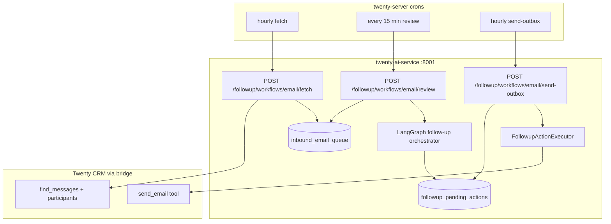

# Person 4 — Task 2 Backend Summary

> **Scope:** Email monitoring workflows, meeting-request draft hardening, accept/outbox backend, NestJS crons.  
> **UI:** Not done — see [`P4_TASK2_UI_NOT_DONE.md`](P4_TASK2_UI_NOT_DONE.md).  
> **Branch:** `full-followup-with-risk` — P2/P3/P4 subagents real by default (`DatabaseRiskAgent` for P3).  
> **Risk details:** [`followup/docs/P1_RISK_AGENT_INTEGRATION.md`](followup/docs/P1_RISK_AGENT_INTEGRATION.md)

---

## Short answer: Orchestrator or stubs?

**Task 2 is linked to the real Follow-Up LangGraph orchestrator — not the Ask AI chat stub.**

| Path | What runs | Stub? |
|------|-----------|-------|
| `POST /followup/events` | Full LangGraph pipeline (`followup/orchestrator/graph.py`) | No |
| `POST /followup/workflows/email/review` | Same graph as above (queued emails) | No |
| `POST /followup/actions/{id}/accept` | Accept graph → `FollowupActionExecutor` → CRM Writer | No |
| P2 next-step subagent (default) | `OrchestratorNextStepAgent` | **Real** |
| P4 drafting subagent (default) | `OrchestratorDraftingAgent` → `run_drafting_agent` | **Real** |
| P3 risk subagent (default) | `DatabaseRiskAgent` (PostgreSQL-backed) | **Real** |
| Ask AI chat → “followup” delegate | `agent/stubs/agent_stubs.py` → `followup_stub` | **Stub** (unchanged; separate from REST pipeline) |

Default API behavior uses **real** P2 + P3 + P4 subagents. Set `FOLLOWUP_USE_MOCK_AGENTS=1` to force all-mock subagents (fast CI / `followup_step7_e2e.py --mock-subagents`). `MockRiskAgent` remains available only in mock/test paths — see P1 risk doc.

---

## Architecture (what was added)



**Sync path (unchanged):** `POST /followup/events` still runs the full pipeline immediately — useful for scripts and manual testing.

**Async path (new):** Fetch stores raw emails in the queue (no LLM). Review drains the queue into the same orchestrator graph.

---

## Files added or changed

### Python — persistence

| File | Purpose |
|------|---------|
| `followup/store/migrations/002_inbound_email_queue.sql` | `followup_agent.inbound_email_queue` table |
| `followup/store/repositories.py` | `InboundEmail`, `InboundEmailRepository`; `PendingActionRepository.list_accepted_for_outbox` |

### Python — email workflows

| File | Purpose |
|------|---------|
| `followup/workflows/email/bridge_reads.py` | Bridge `find_messages` + INCOMING filter + FROM participant |
| `followup/workflows/email/fetch.py` | Phase 1: enqueue new messages (dedupe on `message_id`) |
| `followup/workflows/email/review.py` | Phase 2: claim batch → `graph.ainvoke(entry_point=email)` |
| `followup/workflows/email/send_outbox.py` | Poll accepted actions → `send_drafted_email()` |

### Python — API

| Endpoint | Body | Behavior |
|----------|------|----------|
| `POST /followup/workflows/email/fetch` | `{ workspace_id, since? }` | Bridge read → queue insert |
| `POST /followup/workflows/email/review` | `{ workspace_id, batch_size? }` | Queue → orchestrator → pending actions |
| `POST /followup/workflows/email/send-outbox` | `{ workspace_id, batch_size? }` | Accepted drafts → `send_email` via bridge |

Models in `followup/api/models.py`; routes in `followup/api/routes.py`.

### Python — meeting-request + accept alignment

| File | Change |
|------|--------|
| `scripts/followup_email_scenarios.py` | `stripe_meeting_request` scenario |
| `followup/agents/drafting_adapter.py` | (existing) `_slot_lines()` injects calendar slots into drafter context |
| `followup/emailer/api/accept_builder.py` | Marked deprecated; executor is canonical |
| `scripts/followup_step7_e2e.py` | `--real-subagents` / `--mock-subagents` |
| `scripts/followup_subagents_smoke.py` | Meeting-request classification + sample slots |

### Python — tests

| File | Covers |
|------|--------|
| `tests/test_followup_email_workflows.py` | Fetch dedupe, review processed/skipped, outbox sent |
| `tests/test_followup_agents_adapters.py` | Slot lines, drafter slot injection, `run_tasks` + calendar |
| `followup/emailer/tests/test_drafting_agent.py` | `accept_builder` vs `build_send_email_args` shape |

### NestJS — scheduled jobs

Module: `packages/twenty-server/src/engine/metadata-modules/ai/followup-workflows/`

| Cron | Pattern | Calls |
|------|---------|-------|
| `FollowupEmailFetchCronJob` | `0 * * * *` (hourly) | `/followup/workflows/email/fetch` |
| `FollowupEmailReviewCronJob` | `*/15 * * * *` | `/followup/workflows/email/review` |
| `FollowupEmailSendOutboxCronJob` | `0 * * * *` (hourly) | `/followup/workflows/email/send-outbox` |

Registered via `cron:register:all` (see `database/commands/cron-register-all.command.ts`).

Uses `AI_SERVICE_URL` from `packages/twenty-server/.env` (default `http://127.0.0.1:8001`).

---

## How the orchestrator uses P4 drafting

1. Email enters (sync API or review poller).
2. Graph nodes: `extract` → `load_profile` → `classify` → `assess_risk` → `plan` → `run_tasks` → `create_pending`.
3. For `book_meeting` / `meeting_request`: `check_calendar` runs before `draft_email`.
4. `OrchestratorDraftingAgent.run()` calls real `run_drafting_agent()` with:
   - `DealContext` from profile mapping
   - `available_slots` from calendar prep
   - RAG via `FileRetriever` (`followup/emailer/knowledge/`)
5. Result stored in `followup_pending_actions.draft_result` / `action_payload`.
6. Rep accepts via `POST /followup/actions/{id}/accept` → `FollowupActionExecutor` → direct `send_email` or writer delegation.

**Drafting agent never writes to CRM directly** — same rule as Task 1.

---

## What is still stubbed / not wired

| Item | Notes |
|------|-------|
| **P3 risk agent** | **Done** — `DatabaseRiskAgent` in `build_agent_bundle()`; see [`followup/docs/P1_RISK_AGENT_INTEGRATION.md`](followup/docs/P1_RISK_AGENT_INTEGRATION.md) |
| **Ask AI `followup_stub`** | `agent/agent_registry.py` — chat delegation only; does not call REST pipeline |
| **twenty-front UI** | Zero files; see `P4_TASK2_UI_NOT_DONE.md` |
| **One-click send in UI** | Backend seam exists (`send_drafted_email`); no React button |

File-based RAG (`FileRetriever` + `followup/emailer/knowledge/`) is the intended approach — vector/pgvector RAG is not planned.

---

## How to run

### Prerequisites

- Postgres + Twenty backend (`:3000`) for bridge reads/writes
- `twenty-ai-service` on `:8001` with `.env` LLM + `TWENTY_*` identity
- Migrations applied on API startup (`followup/api/dependencies.py` → `apply_migrations()`)

### Start Python service

```bash
cd packages/twenty-ai-service
uvicorn main:app --reload --port 8001
```

### Manual workflow triggers

```bash
curl -X POST http://127.0.0.1:8001/followup/workflows/email/fetch \
  -H "Content-Type: application/json" \
  -d '{"workspace_id": "<WORKSPACE_UUID>"}'

curl -X POST http://127.0.0.1:8001/followup/workflows/email/review \
  -H "Content-Type: application/json" \
  -d '{"workspace_id": "<WORKSPACE_UUID>", "batch_size": 10}'
```

### E2E scripts

```bash
# Full pipeline + accept (real subagents by default)
.venv/Scripts/python.exe scripts/followup_step7_e2e.py --scenario stripe_meeting_request

# Fast mock subagents
.venv/Scripts/python.exe scripts/followup_step7_e2e.py --mock-subagents --no-accept

# Drafting + next-step only (no DB/bridge)
.venv/Scripts/python.exe scripts/followup_subagents_smoke.py --scenario stripe_meeting_request
```

### Unit tests (Task 2 additions)

```bash
cd packages/twenty-ai-service
.venv/Scripts/python.exe -m pytest tests/test_followup_email_workflows.py -v
.venv/Scripts/python.exe -m pytest tests/test_followup_agents_adapters.py::test_slot_lines_formats_available_slots -v
```

### Register crons (when worker is running)

```bash
yarn nx run twenty-server:command cron:register:all
```

---

## Env vars (relevant)

| Variable | Package | Purpose |
|----------|---------|---------|
| `AI_SERVICE_URL` | twenty-server | Base URL for follow-up workflow crons |
| `FOLLOWUP_USE_MOCK_AGENTS` | twenty-ai-service | `1` = mock P2/P3/P4 in orchestrator |
| `FOLLOWUP_SUBAGENT_MODEL` | twenty-ai-service | Model for next-step + drafting adapters |
| `FOLLOWUP_ORCHESTRATOR_MODEL` | twenty-ai-service | Model for classify / content authoring |
| `TWENTY_WORKSPACE_ID` | twenty-ai-service | E2E scripts |
| `TWENTY_USER_ID` | twenty-ai-service | E2E accept + calendar reads |
| `PG_DATABASE_URL` | twenty-ai-service | `followup_agent` schema in `default` DB |

---

## Queue status semantics

| Status | Meaning |
|--------|---------|
| `pending` | Fetched, waiting for review poller |
| `processing` | Claimed by review batch |
| `processed` | Pipeline completed with pending action |
| `skipped` | No deal resolved / no action created |
| `failed` | Pipeline or review error |

---

## Related docs

- [`P4_TASK2_UI_NOT_DONE.md`](P4_TASK2_UI_NOT_DONE.md) — frontend checklist (not started)
- [`followup/docs/P1_RISK_AGENT_INTEGRATION.md`](followup/docs/P1_RISK_AGENT_INTEGRATION.md) — P3 risk agent (PostgreSQL-backed)


---

## Success criteria (met)

- [x] Cron can fetch inbound emails into queue without LLM
- [x] Review poller runs real LangGraph orchestrator (not stub)
- [x] Meeting-request path injects calendar slots into real drafter
- [x] Accept API + outbox send backend (no React UI)
- [x] No changes under `packages/twenty-front/`
