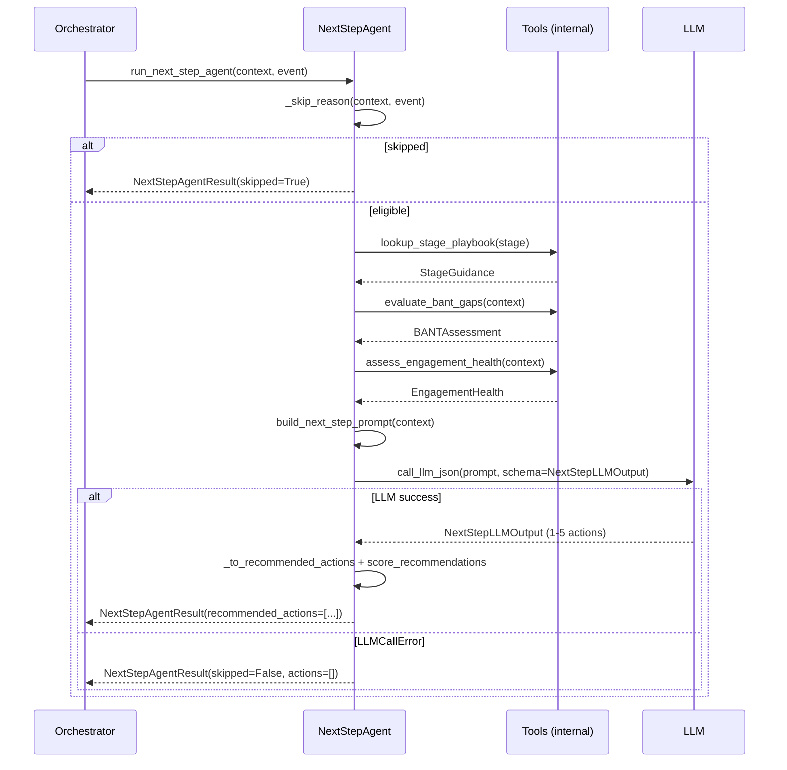
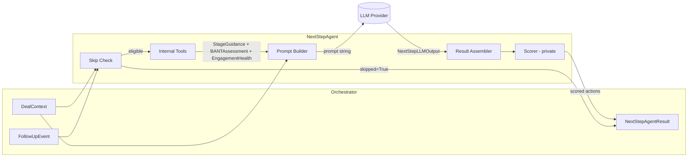

# Next Step Intelligence Agent — Architecture

**Owner:** Person 2 (Next Step Agent)
**Location:** `followup/agents/next_step/`
**Version:** 2.0 (tool-based, Orchestrator-only communication)

---

## Overview

The Next Step Intelligence Agent is a single-responsibility AI agent that
analyzes a B2B sales deal and recommends **up to 5 prioritized next actions**
for the sales representative.

It operates under a strict communication model:

```
Orchestrator --> run_next_step_agent(context, event) --> NextStepAgentResult --> Orchestrator
```

- The agent's **only caller** is the Orchestrator.
- The agent's **only output** is `NextStepAgentResult`.
- The agent **does not communicate with any other agent**.
- All CRM actions are returned as `OrchestratorAction` objects for the
  Orchestrator to evaluate and optionally execute — the agent never
  writes to the CRM directly.

---

## Responsibilities

| Responsibility | Details |
|---|---|
| Skip detection | Return early with `skipped=True` for closed deals, missing company context, or ineligible event types |
| Internal tool analysis | Run playbook lookup, BANT gap assessment, and engagement health check |
| Prompt construction | Assemble all context + tool outputs into a single structured LLM prompt |
| Structured LLM call | Call `call_llm_json` once with `schema=NextStepLLMOutput` |
| Internal scoring | Rank and cap recommendations using private scoring logic |
| Result assembly | Build `NextStepAgentResult` with `OrchestratorAction` objects for the Orchestrator |

---

## Non-Responsibilities

| Out of scope | Who owns it |
|---|---|
| RAG / vector retrieval | Removed in v2.0 — replaced by internal tools |
| CRM writes (tasks, notes, meetings) | Orchestrator executes via `OrchestratorAction` |
| Event ingestion and routing | Orchestrator |
| Risk assessment | Risk Intelligence Agent (separate) |
| Email/message drafting | Drafting Agent (separate) |
| Database persistence | Orchestrator / infrastructure layer |
| Communication with other agents | Prohibited — all routing via Orchestrator |
| Exposing scoring formulas | All scoring is internal and never returned |

---

## Dependencies

```
followup/agents/next_step/
  imports from:
        followup/context/schemas.py      <- DealContext (P1 contract)
        followup/events/schemas.py       <- FollowUpEvent, FollowUpEventType (P1 contract)
        agent/llm_client.py              <- call_llm_json, LLMCallError (shared infra)
```

No RAG dependencies. No agent-to-agent imports. No CRM SDK imports.

---

## Folder Structure

```
followup/agents/next_step/
├── __init__.py               # Public exports: run_next_step_agent, result types
├── next_step_agent.py        # Main entry point + skip logic + result assembly
├── tools.py                  # Internal analysis tools (replaces RAG)
├── schemas.py                # OrchestratorAction, RecommendedAction, NextStepAgentResult,
│                             #   NextStepLLMActionItem, NextStepLLMOutput
├── prompts.py                # Runs tools, formats context, builds LLM prompt
├── scoring.py                # Internal ranking + 5-recommendation cap (private)
├── NEXT_STEP_AGENT_ARCHITECTURE.md
└── knowledge/                # Human-readable reference docs, not loaded at runtime
    ├── bant.md
    ├── best_practices.md
    └── playbooks/
```

---

## Execution Flow

```
1. Orchestrator calls run_next_step_agent(context, event)
        |
2. Skip check (_skip_reason)
   ├── stage starts with "closed"     -> return skipped=True
   ├── context.company is None        -> return skipped=True
   └── event.event_type not eligible  -> return skipped=True
        |
3. Run internal tools (inside build_next_step_prompt):
   ├── lookup_stage_playbook(stage)      -> StageGuidance
   ├── evaluate_bant_gaps(context)       -> BANTAssessment
   └── assess_engagement_health(context) -> EngagementHealth
        |
4. Build prompt (all context + tool outputs combined)
        |
5. call_llm_json(prompt, schema=NextStepLLMOutput)
   └── LLMCallError -> return empty result, skipped=False (retriable)
        |
6. _to_recommended_actions -> list[RecommendedAction] with OrchestratorAction
        |
7. score_recommendations -> ranked, capped at 5 (internal logic, not exposed)
        |
8. Return NextStepAgentResult -> Orchestrator
```

---

## Sequence Diagram



---

## Data Flow Diagram



---

## Internal Tool Strategy

The agent uses three deterministic internal tools instead of RAG retrieval.
All tools are pure Python functions in `tools.py` — no I/O, no network calls.

| Tool | Input | Output | Purpose |
|---|---|---|---|
| `lookup_stage_playbook(stage)` | stage string | `StageGuidance` | Stage objective, key activities, exit criteria, pitfalls |
| `evaluate_bant_gaps(context)` | `DealContext` | `BANTAssessment` | Budget/Authority/Need/Timeline qualification gaps |
| `assess_engagement_health(context)` | `DealContext` | `EngagementHealth` | Deal engagement status, trend, and risk flags |

Tool outputs are formatted by `prompts.py` into the LLM prompt as structured
sections. They are never returned to the Orchestrator.

---

## Closed Stage Handling

In v2.0, Closed Won and Closed Lost are unified into a single "Closed" status.
The skip check uses:

```python
def _is_closed(stage: str) -> bool:
    return stage.lower().startswith("closed")
```

This handles all variants: `"Closed"`, `"Closed Won"`, `"Closed Lost"`.
The canonical stage value going forward is `"Closed"`.

---

## Scoring Strategy (Internal)

Scoring is performed by `scoring.py` and is entirely private — no weights,
boosts, or formulas are returned to the Orchestrator or any other caller.

**What happens internally:**

1. Each `RecommendedAction` receives a priority boost (lower = higher rank)
   for each of the following signals found in its text:
   - Matches the current pipeline stage name
   - Addresses an engagement gap (days since last activity > 7)
   - Addresses an overdue task
   - Addresses a BANT gap

2. Actions are sorted ascending by boosted priority.

3. The result is capped at **5 recommendations**.

The Orchestrator receives only the final sorted list.

---

## 5-Step Recommendation Workflow

Each `NextStepAgentResult` may contain up to 5 `RecommendedAction` objects,
sorted by priority. The five positions represent a natural workflow sequence:

| Priority | Typical role |
|---|---|
| 1 | Immediate blocker — must be resolved before any other step |
| 2 | High-impact action — advances the deal significantly |
| 3 | Supporting action — reinforces momentum |
| 4 | Relationship / qualification action — fills BANT or stakeholder gaps |
| 5 | Strategic / forward-looking action — sets up the next stage |

The LLM assigns initial priorities (1-5). The scoring engine may boost actions
based on deal signals. The Orchestrator receives a clean ranked list.

---

## OrchestratorAction Model

Every `RecommendedAction` carries an `OrchestratorAction` the Orchestrator
may choose to execute:

```python
class OrchestratorAction(BaseModel):
    tool: str          # e.g. "create_task", "schedule_meeting", "send_email"
    instruction: str   # natural-language instruction referencing the opportunity id
    params: dict[str, str]  # {"opportunity_id": "opp-123", ...}
```

**Valid tool names:**

| Tool | What the Orchestrator does |
|---|---|
| `create_task` | Creates a CRM task on the opportunity |
| `schedule_meeting` | Schedules a meeting with specified contacts |
| `send_email` | Sends a follow-up email via the CRM |
| `update_opportunity` | Updates a field on the opportunity record |
| `log_activity` | Logs an activity note to the timeline |
| `create_reminder` | Sets a reminder for the sales rep |

The Orchestrator decides which actions to execute. The agent never executes
any tool directly.

---

## Eligible Event Types

The agent only runs for these three event types:

| Event type | Rationale |
|---|---|
| `opportunity_created` | New deal needs an initial next-step plan |
| `opportunity_stage_changed` | Stage transition triggers a new action set |
| `meeting_completed` | Post-meeting follow-up recommendations |

All other event types return `skipped=True`.

---

## Integration with Orchestrator

```python
from followup.agents.next_step import run_next_step_agent

result = await run_next_step_agent(context, event)

if result.skipped:
    # Log and discard — no further action needed
    return

if not result.recommended_actions:
    # LLM failure (skipped=False, actions=[]) — Orchestrator may retry
    schedule_retry(context.opportunity.id, event)
    return

for action in result.recommended_actions:
    if orchestrator_should_execute(action):
        await orchestrator.execute_tool(
            tool=action.orchestrator_action.tool,
            instruction=action.orchestrator_action.instruction,
            params=action.orchestrator_action.params,
        )
```

---

## Testing Strategy

**Test file:** `followup/tests/test_next_step_agent.py`
**Coverage target:** 90%+

| Test group | Tests | What is verified |
|---|---|---|
| Skip — closed stages | 3 | Closed Won, Closed Lost, unified Closed all skip |
| Skip — other | 2 | No company, ineligible event type |
| Happy path | 2 | Recommendations returned, all have reasoning + evidence |
| OrchestratorAction | 2 | Instruction contains opp id, tool and params populated |
| Scoring | 1 | Overdue + stage match boosts priority correctly |
| LLM failure | 1 | Returns empty non-skipped result (retriable) |
| Cap enforcement | 2 | Never more than 5 recommendations |

**Mocking strategy:**
- LLM: `monkeypatch.setattr("followup.agents.next_step.next_step_agent.call_llm_json", fake)`
- Internal tools: no mocking needed — pure functions with deterministic output
- No RAG stubs required

---

## Future Enhancements

| Enhancement | Notes |
|---|---|
| Additional orchestrator tools | e.g. `create_proposal`, `assign_rep`, `escalate_to_manager` |
| Confidence-weighted execution | Orchestrator auto-executes only actions above a confidence threshold |
| Feedback loop | Orchestrator reports which actions were accepted; agent uses this to improve scoring |
| Per-industry playbooks | Extend `tools.py` with industry-specific playbook variants |
| Multi-contact recommendations | Actions targeting specific contacts, not just the opportunity |
| Stage exit velocity tracking | Use `days_in_current_stage` to boost urgency signals |
