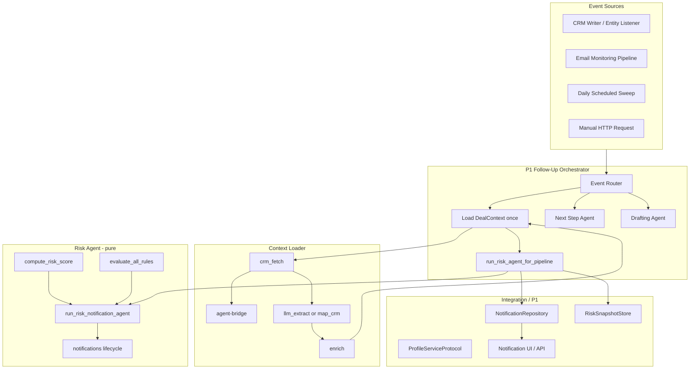

# P1 Integration Handoff — Deal Context Loader & Risk Agent

**Audience:** Developer responsible for **P1 — Follow-Up Orchestrator**

**Package:** `packages/twenty-ai-service`

**Related docs:**

- Team usage overview: [DEAL_CONTEXT_AND_RISK_AGENT.md](../DEAL_CONTEXT_AND_RISK_AGENT.md)
- Loader internals: [DEAL_CONTEXT_LOADER.md](../DEAL_CONTEXT_LOADER.md)
- Risk agent file reference: [agents/risk/README.md](../agents/risk/README.md)
- Full system spec: [FOLLOWUP_INTELLIGENCE_LAYER_FINAL_SPEC.md](../../FOLLOWUP_INTELLIGENCE_LAYER_FINAL_SPEC.md)

This document describes the **implemented** contracts and behavior as of the current codebase. When this handoff differs from an older plan, **the code wins**.

---

## 1. Purpose of this handoff

P1 must connect the Follow-Up Orchestrator to two implemented components:

1. **Standalone Deal Context Loader** — loads and normalizes live CRM data into `DealContext`
2. **Risk Scoring & Notification Agent** — scores deal health and returns notification recommendations

The orchestrator owns workflow routing. The Risk Agent is a **sub-agent** — it does not control the overall follow-up pipeline.

```text
Follow-Up Orchestrator
    ├── Next Step Agent          (not yet wired in this package)
    ├── Risk Scoring & Notification Agent   ← this handoff
    └── Drafting Agent           (not yet wired in this package)
```

The Risk Agent:

- Reads a prepared `DealContext`
- Evaluates deterministic rules
- Returns a score, level, rule evaluations, and up to two new notifications
- Does **not** own CRM writes, database persistence, scheduling, or UI display

P1 owns event routing, context loading orchestration, persistence, and downstream agent coordination.

---

## 2. Updated architecture overview



**The pure Risk Agent does not call:**

| System | Who owns it |
|--------|-------------|
| Twenty CRM (reads) | Context Loader via agent-bridge |
| Twenty CRM (writes) | CRM Writer / CRM Orchestrator |
| Database | P1 repositories |
| Frontend notification UI | Backend + frontend integration |
| Email send / meeting schedule | Drafting Agent / CRM Writer |

---

## 3. What changed in the Deal Context design

### Before

- `DealContext` existed mainly as JSON test fixtures
- Each agent would need to assemble context manually
- Empty lists were ambiguous (no data vs. query failure)

### Now

- **`load_deal_context()`** is a shared, importable entry point (`followup/context/loader.py`)
- One normalized `DealContext` can be passed to Risk, Next Step, and Drafting agents
- **`context_completeness`** records whether each section was loaded, partial, or unavailable
- **Canonical stages** (`PROPOSAL`, `CLOSED_WON`, …) via `stage_normalization.py`
- **Scalar opportunity fields** (`emailText`, `notes`) appear in `timeline[]` with explicit timestamp semantics

### Current `DealContext` schema

Source: `followup/context/schemas.py`

| Field | Type | Description |
|-------|------|-------------|
| `opportunity` | `OpportunitySnapshot` | Core deal record |
| `company` | `CompanySnapshot \| null` | Linked company |
| `contacts` | `list[ContactSnapshot]` | People on the deal |
| `timeline` | `list[TimelineItem]` | Emails, notes, activities |
| `tasks` | `list[TaskSnapshot]` | Tasks linked to the deal |
| `meetings` | `list[MeetingSnapshot]` | Scheduled meetings |
| `pipeline_meta` | `PipelineMeta` | Stage list + SLA configuration |
| `engagement` | `EngagementMetrics` | Computed recency metrics |
| `context_provenance` | `"profile_primary" \| "crm_fallback" \| "hybrid"` | How context was built |
| `context_completeness` | `ContextCompleteness \| null` | Per-section load status (v2) |
| `loaded_at` | `datetime \| null` | Assembly timestamp |

**Not on `DealContext` today:** `profile_id`, active profile facts, or orchestrator metadata. The sweep optionally calls `ProfileServiceProtocol` using `getattr(context, "profile_id", None)`, which is always `None` unless P1 extends the model.

#### Nested types

**`OpportunitySnapshot`**

| Field | Type | Notes |
|-------|------|-------|
| `id` | `str` | Opportunity UUID |
| `name` | `str` | Display name |
| `stage` | `str` | Canonical `SCREAMING_SNAKE_CASE` |
| `amount` | `float \| null` | Currency units |
| `close_date` | `datetime \| null` | Expected close |
| `company_id` | `str \| null` | Linked company |
| `owner_id` | `str \| null` | Opportunity owner — **not** bridge auth user |
| `updated_at` | `datetime \| null` | CRM `updatedAt` |
| `stage_entered_at` | `datetime \| null` | Only from CRM `stageEnteredAt` |

**`ContactSnapshot`:** `id`, `name`, `role`, `is_decision_maker: bool` (default `false`)

**`TimelineItem`:** `type`, `title`, `summary`, `occurred_at`, `source`, `timestamp_source`

**`TaskSnapshot`:** `id`, `title`, `status`, `due_at`, `is_overdue`

**`MeetingSnapshot`:** `id`, `title`, `starts_at`, `status`

**`PipelineMeta`:** `stages: list[str]`, `stage_sla_days: dict[str, int]`, `source: "crm_metadata" \| "fallback_defaults" \| null`

**`EngagementMetrics`:** `days_since_last_activity: int \| null`, `activity_count_14d`, `activity_count_prior_14d`, `has_future_meeting`

---

## 4. Context completeness

Source: `followup/context/completeness.py`

### Why it exists

An empty list must no longer mean "no records exist." It may mean "we could not query this section."

### Status values

| Status | Meaning |
|--------|---------|
| `loaded` | Section was retrieved successfully |
| `partial` | Some data present, but not the full expected dataset |
| `unavailable` | Section could not be retrieved — do not infer absence |
| `not_requested` | Section was intentionally not loaded |

### Sections tracked

`opportunity`, `company`, `contacts`, `timeline`, `tasks`, `meetings`, `pipeline_metadata`

### Examples

```text
tasks = []  +  tasks.status = loaded
→ Queried successfully; no tasks exist

tasks = []  +  tasks.status = unavailable
→ Task query failed; rules must NOT assume "no overdue tasks"
```

### How P1 should use completeness

1. **Pass `context_completeness` through orchestrator results** for UI and debugging
2. **Do not summarize skipped rules as healthy** — e.g. "no meetings scheduled" when meetings are `unavailable`
3. **Prefer `reasoning_summary`** from the Risk Agent — it already mentions unverified meetings/tasks
4. **Legacy fixtures** with `context_completeness: null` behave as if all sections are `loaded` (`section_status` default)

### Live fetch defaults (current bridge limitations)

Set by `build_bridge_fetch_completeness()` in `crm_fetch.py`:

| Section | Typical live status | Reason |
|---------|---------------------|--------|
| `timeline` | `partial` | Scalar `emailText`/`notes` loaded; linked activity records unavailable |
| `tasks` | `unavailable` | Reader tool lacks opportunity relationship filter |
| `meetings` | `unavailable` | No supported meeting query configured |
| `pipeline_metadata` | `loaded` or `unavailable` | Depends on `get_field_metadata` success |

---

## 5. Why email content appears under timeline

CRM Opportunity scalar fields:

```text
emailText
notes
```

The loader normalizes these into `timeline[]` via `opportunity_scalar_timeline.py` so all deal text is searchable in one structure.

**Example timeline entry:**

```json
{
  "type": "email",
  "title": "Follow-up on Platform Migration Proposal",
  "summary": "...",
  "occurred_at": null,
  "source": "opportunity.emailText",
  "timestamp_source": "unavailable"
}
```

### Rules for P1 and downstream agents

| Rule | Detail |
|------|--------|
| Confirms live read | Scalar `emailText`/`notes` are being loaded from the Opportunity record |
| Not a full CRM email activity | This is Opportunity field content, not a linked email object with full metadata |
| No fake timestamps | `occurred_at` stays `null` when no trustworthy date exists |
| `updatedAt` is not email date | Opportunity `updated_at` must never substitute for email occurrence time |
| Timeline may be `partial` | Scalar content present; linked CRM activity records may be missing |
| Proposal evidence | `has_proposal_evidence()` scans timeline title/summary (including undated entries) |
| Objection detection | `detect_customer_objections()` scans timeline text for regex patterns — used in LLM notification copy, **not scored** |
| Recency scoring | Undated entries excluded from `days_since_last_activity` and 14-day counts (`enrich.py`) |

**Proposal evidence tokens** (from `rules.py`): `proposal`, `quote`, `quotation`, `pricing`, `contract`, `sow`, and related phrases.

**Objection categories** (from `objections.py`): `security`, `privacy`, `pricing`, `legal`, `timeline`, `authority`, `integration`.

---

## 6. Stage normalization and pipeline metadata

Source: `followup/context/stage_normalization.py`

### Canonical stages

```text
NEW
SCREENING
MEETING
PROPOSAL
CUSTOMER
CLOSED_WON
CLOSED_LOST
```

Aliases like `"Closed Won"` normalize to `CLOSED_WON`.

### Key helpers

| Function | Purpose |
|----------|---------|
| `normalize_stage(value)` | Convert CRM label → canonical `SCREAMING_SNAKE_CASE` |
| `stage_index_in_pipeline(stage, pipeline_stages)` | Index in ordered pipeline |
| `stage_at_or_after(stage, threshold, pipeline_stages)` | True when stage is at or past threshold |
| `stage_after(stage, threshold, pipeline_stages)` | True when strictly after threshold |
| `is_closed_stage(stage)` | True for `CLOSED_WON` or `CLOSED_LOST` |
| `build_stage_sla_days(stages)` | Default SLA map from stage list |

### Pipeline metadata

| Field | Source |
|-------|--------|
| `pipeline_meta.stages` | Live `get_field_metadata` for opportunity `stage`, or `FALLBACK_PIPELINE_STAGES` |
| `pipeline_meta.stage_sla_days` | CRM metadata or `DEFAULT_STAGE_SLA_DAYS` |
| `pipeline_meta.source` | `"crm_metadata"` or `"fallback_defaults"` |

### Stage-entry time

| Field | Rule |
|-------|------|
| `stage_entered_at` | Only from CRM `stageEnteredAt` |
| `updated_at` | Record update time — **never** used as stage-entry substitute |
| `stalled_stage` rule | **Skipped** when `stage_entered_at` is `null` |

---

## 7. Risk Agent responsibility

### The Risk Agent does

| Action | Module |
|--------|--------|
| Read `DealContext` | `agent.py`, `rules.py` |
| Evaluate 8 deterministic rules | `rules.py` |
| Calculate score (0–100) and level | `rules.py` |
| Return per-rule `RuleEvaluation` | `evaluation.py` |
| Select up to 2 notifications | `notifications.py` |
| Produce `reasoning_summary` | `agent.py` |
| Optionally enrich with `deal_risk_report` | `agent.py` (non-blocking read) |
| Export `build_profile_fact_update_suggestions()` | `agent.py` (helper — **not auto-called**) |

### The Risk Agent does not

```text
write to CRM
send emails
schedule meetings
modify opportunities
access the database directly
control the frontend
persist notifications (unless caller passes a repository to the integration layer)
```

P1 or the integration layer owns persistence, routing, and UI.

---

## 8. Current deterministic risk rules

Source: `followup/agents/risk/rules.py`

**Score thresholds** (`risk_level_for_score`):

| Level | Score range |
|-------|-------------|
| LOW | 0–39 |
| MEDIUM | 40–69 |
| HIGH | 70–100 (capped at 100) |

**Notification eligibility** (`should_notify`): score ≥ 40 **or** any high-severity factor; max **2** per run.

### Rules table

| Rule ID | Pts | Severity | Trigger condition | Required data | Not triggered when | Skipped when | Completeness impact |
|---------|-----|----------|-------------------|-----------------|-------------------|--------------|---------------------|
| `no_activity_7d` | 25 | high | No trustworthy dated activity ≥ 7 days, or `days_since_last_activity` is `null` with timeline not `unavailable` | `engagement.days_since_last_activity`, timeline | Dated activity &lt; 7 days ago | `timeline.status = unavailable` | Undated scalar email does **not** count as recent activity |
| `no_future_meeting` | 20 | high | Open deal, no future meeting | `engagement.has_future_meeting`, `meetings` | Future meeting exists | Closed stage; **`meetings.status = unavailable`** | Skips instead of asserting "no meeting" |
| `stalled_stage` | 20 | high | Days in stage &gt; SLA | `stage_entered_at`, `pipeline_meta.stage_sla_days` | Within SLA | Closed stage; **`stage_entered_at` null**; no SLA for stage | — |
| `missing_decision_maker` | 15 | medium | Stage ≥ `MEETING`, no `is_decision_maker` contact | `contacts`, `opportunity.stage` | Decision-maker contact found | Closed stage; before MEETING threshold | Scoring does not yet skip when contacts `unavailable` (see §23) |
| `missing_proposal` | 20 | high | Stage ≥ `PROPOSAL`, no proposal evidence in timeline | `timeline`, `pipeline_meta.stages` | Proposal evidence in timeline text | Closed stage; before PROPOSAL | Undated email/notes **can** satisfy evidence check |
| `overdue_tasks` | 15 | medium | Any `task.is_overdue` | `tasks` | No overdue tasks | **`tasks.status = unavailable`** | — |
| `engagement_drop` | 10 | medium | Recent 14d activity &lt; 50% of prior 14d | Dated timeline counts | No prior baseline; drop below threshold not met | — | Requires dated activity in both windows |
| `past_expected_close_date` | 20 | high | Open deal, `close_date` in the past | `opportunity.close_date` | Close date not passed or missing | Closed stage; no close date | — |

**Notification priority order** (`NOTIFICATION_PRIORITY`):

```text
past_expected_close_date → no_activity_7d → no_future_meeting →
missing_decision_maker → missing_proposal → overdue_tasks →
stalled_stage → engagement_drop
```

---

## 9. Rule evaluation statuses

Source: `followup/agents/risk/evaluation.py`

```python
class RuleEvaluation:
    rule_id: str
    status: Literal["triggered", "not_triggered", "skipped"]
    reason: str
    factor: RiskFactor | None  # present when triggered
```

| Status | Meaning for P1 |
|--------|----------------|
| `triggered` | Confirmed risk; contributes to score |
| `not_triggered` | Data was sufficient; condition not met |
| `skipped` | Data unavailable or insufficient; **no confident conclusion** |

**P1 must not** present `skipped` rules as confirmed healthy or confirmed risky.

The HTTP evaluate endpoint returns `rule_evaluations` alongside the score. Use `evaluate_all_rules(context, now=...)` for debugging without running the full agent.

---

## 10. Risk Agent input contract

### Pure agent

```python
async def run_risk_notification_agent(
    context: DealContext,
    event: FollowUpEvent,
    existing_notifications: list[Notification],
    *,
    now: datetime | None = None,
    llm_generator: LLMCopyGenerator | None = None,
) -> RiskNotificationAgentResult
```

**Returns `RiskNotificationAgentResult`:**

| Field | Type |
|-------|------|
| `risk_score` | `RiskScore` (score, level, factors, computed_at, reasoning_summary) |
| `notifications` | `list[Notification]` — new notifications only, after lifecycle dedupe |
| `reasoning_summary` | `str` |

**Does not return:** `ProfileFactUpdateSuggestion` — call `build_profile_fact_update_suggestions()` separately if needed.

### Integration wrapper (recommended for P1)

```python
async def run_risk_agent_for_pipeline(
    event: FollowUpEvent,
    list_existing_notifications: Callable[[str, str], Awaitable[list[Notification]]],
    *,
    context: DealContext | None = None,
    save_notifications: Callable[[list[Notification]], Awaitable[list[Notification]]] | None = None,
    notification_repository: NotificationRepository | None = None,
    use_llm_context: bool = True,
    llm_generator: LLMCopyGenerator | None = None,
    now: datetime | None = None,
) -> RiskNotificationAgentResult
```

| When to use | Function |
|-------------|----------|
| Orchestrator has an event; may need context load, dedupe, persistence | `run_risk_agent_for_pipeline()` |
| Context and existing notifications already loaded; want pure scoring | `run_risk_notification_agent()` |

### Event types that include risk routing

From `EVENT_TYPES_WITH_RISK_AGENT` in `integration/risk_for_pipeline.py`:

```python
OPPORTUNITY_CREATED
OPPORTUNITY_UPDATED
OPPORTUNITY_STAGE_CHANGED
EMAIL_SENT
PROPOSAL_SENT
TASK_COMPLETED
ACTIVITY_LOGGED
DAILY_RISK_SWEEP
```

---

## 11. Avoiding duplicate DealContext loading

`run_risk_agent_for_pipeline()` loads context **only when `context is None`:**

```python
if deal_context is None:
    deal_context = await load_deal_context(
        event.opportunity_id,
        event.workspace_id,
        event.user_id,
        use_llm=use_llm_context,
    )
```

**Preferred orchestrator flow:**

```python
context = await load_deal_context(
    event.opportunity_id,
    event.workspace_id,
    event.user_id,
)

risk_result = await run_risk_agent_for_pipeline(
    event,
    list_existing_notifications,
    context=context,  # no second CRM fetch
)

# next_step_result = await run_next_step_agent(event, context=context, ...)
```

All sub-agents processing the same event should share **one context snapshot** for consistency and performance.

---

## 12. Event-based integration

### `FollowUpEvent` schema

Source: `followup/events/schemas.py`

```python
class FollowUpEvent(BaseModel):
    event_id: str
    idempotency_key: str
    event_type: FollowUpEventType
    opportunity_id: str
    workspace_id: str
    user_id: str                          # authenticated user for bridge access
    source: Literal["crm_writer", "entity_listener", "manual", "replay", "daily_sweep"]
    source_event_id: str | None = None
    occurred_at: datetime
    payload: dict[str, Any]
    metadata: dict[str, Any]
```

### Routing guidance

| Event | Run Risk Agent? | Notes |
|-------|-----------------|-------|
| `opportunity_created` | Yes | Initial score baseline |
| `opportunity_updated` | Yes | |
| `opportunity_stage_changed` | Yes | Payload may include `new_stage` |
| `email_sent` | Yes | |
| `proposal_sent` | Yes | |
| `task_completed` | Yes | |
| `activity_logged` | Yes | |
| `meeting_completed` | Optional | In enum; not in `EVENT_TYPES_WITH_RISK_AGENT` today |
| `daily_risk_sweep` | Yes | Batch sweep events |
| Manual HTTP evaluate | Yes | Synthetic `OPPORTUNITY_UPDATED` event |

**Routing example:**

```python
from followup.integration.risk_for_pipeline import (
    EVENT_TYPES_WITH_RISK_AGENT,
    run_risk_agent_for_pipeline,
)

if event.event_type in EVENT_TYPES_WITH_RISK_AGENT:
    risk_result = await run_risk_agent_for_pipeline(
        event,
        dependencies.list_existing_notifications,
        context=context,
        notification_repository=dependencies.notification_repository,
        now=dependencies.clock.now(),
    )
```

**Identity warning:** `event.user_id` must be the **authenticated Twenty user** (`TWENTY_USER_ID`), not the opportunity `owner_id`.

---

## 13. Daily risk sweep integration

Source: `followup/workflows/risk_sweep/sweep.py`

### What it does

```text
list active opportunities
    → filter closed stages (is_closed_stage)
    → for each opportunity:
        load DealContext (authenticated user_id)
        run Risk Agent via run_risk_agent_for_pipeline
        compare score to previous snapshot
        persist snapshot
        persist new notifications
        continue on individual failures
```

### Public function

```python
async def run_daily_risk_sweep(
    workspace_id: str,
    *,
    list_active_opportunities: Callable[[str], Awaitable[list[dict[str, str]]]],
    load_deal_context_fn: LoadDealContext | None = None,
    snapshot_store: RiskSnapshotStore,
    list_existing_notifications: ListExistingNotifications | None = None,
    notification_repository: NotificationRepository | None = None,
    profile_service: ProfileServiceProtocol | None = None,
    llm_generator: LLMCopyGenerator | None = None,
    use_llm_context: bool = True,
    now: datetime | None = None,
    limit: int | None = None,
) -> RiskSweepResult
```

### Opportunity record shape

```python
{
    "id": "<opportunity_uuid>",
    "owner_id": "<crm_owner_uuid>",       # ownership only
    "user_id": "<authenticated_user>",  # bridge auth — preferred
    "stage": "PROPOSAL",
    "name": "Deal Name",
}
```

```python
user_id = opportunity.get("user_id") or opportunity.get("owner_id", "")
```

**Always set `user_id` explicitly** in production schedulers. Do not rely on `owner_id` fallback.

### `RiskSweepResult` fields

`evaluated_count`, `succeeded_count`, `failed_count`, `notifications_created`, `snapshot_count`, `re_engagement_triggers`, `results[]`, `errors[]`

---

## 14. Risk snapshots and score comparison

Source: `followup/workflows/risk_sweep/compare.py`

### Why snapshots exist

Track whether deal risk is **new**, **worsening**, **unchanged**, or **improving** across runs.

### Comparison logic (`build_score_comparison`)

| Condition | Behavior |
|-----------|----------|
| First snapshot | `delta = None` |
| Score worsens by ≥ 10 | `significant_delta = True` |
| Crosses into MEDIUM or HIGH | `level_crossed_up = True` |
| First score ≥ 40 | `crossed_threshold = True` |
| Improving score (negative delta) | Recorded; `needs_re_engagement_draft()` returns `False` |

`needs_re_engagement_draft(snapshot)` is `True` when `threshold_crossed` or `level_crossed_up`, and delta is not negative.

### Development vs production stores

| Store | Behavior |
|-------|----------|
| `InMemoryRiskSnapshotStore` | Data lost on process restart → `delta=None` again |
| Production `RiskSnapshotStore` | P1 must implement Postgres-backed persistence |

---

## 15. Notification lifecycle and deduplication

Source: `followup/agents/risk/notifications.py`

### Flow

```text
Risk factors
    → rank by NOTIFICATION_PRIORITY + severity
    → select up to MAX_NOTIFICATIONS_PER_RUN (2)
    → generate copy (LLM or template)
    → apply_notification_lifecycle (dedupe + dismiss suppression)
    → return new notifications only
```

### Constants

| Constant | Value |
|----------|-------|
| `MAX_NOTIFICATIONS_PER_RUN` | 2 |
| `DISMISS_SUPPRESS_DAYS` | 7 |

### Notification statuses

`unread`, `read`, `dismissed`, `acted_on`

### Lifecycle rules

| Scenario | Behavior |
|----------|----------|
| First run | Creates notifications |
| Identical re-run | No duplicates (key: `opportunity_id` + `rule_id`) |
| Dismissed within 7 days | Suppressed for that `rule_id` |
| Dismissed after 7 days | May be recreated if factor still applies |
| Closed stage | Score computed; **no notifications** |

The repository stores only what lifecycle already approved. **Do not duplicate business logic in the repository.**

---

## 16. Persistence boundary

### Protocols

**`NotificationRepository`** (`followup/notifications/repository.py`):

```python
async def list_for_opportunity(*, opportunity_id, user_id) -> list[Notification]
async def save_many(notifications) -> list[Notification]
async def update_status(*, notification_id, status) -> Notification
```

**`RiskSnapshotStore`** (`followup/store/risk_snapshot_store.py`):

```python
async def get_latest_snapshot(opportunity_id, workspace_id) -> RiskScoreSnapshot | None
async def save_snapshot(snapshot) -> RiskScoreSnapshot
```

### Development implementations

| Class | Use |
|-------|-----|
| `InMemoryNotificationRepository` | Local dev and tests — data lost on restart |
| `InMemoryRiskSnapshotStore` | Local dev and tests — data lost on restart |

### Not connected yet

For notifications to appear in the Twenty UI, P1 still needs:

```text
persistent database repository (Postgres)
notification read/update API
frontend notification component
```

The HTTP endpoint's `persist_notifications=true` uses a **module-level in-memory dev store** (`_DEV_REPOSITORIES` in `routes_risk.py`) — not production persistence.

---

## 17. HTTP endpoint

**Implemented:** `POST /followup/risk/{opportunity_id}/evaluate`

Source: `followup/api/routes_risk.py`, mounted via `followup/api/router.py` in `main.py`.

### Query parameters

| Param | Required | Default | Description |
|-------|----------|---------|-------------|
| `workspace_id` | Yes | — | Workspace UUID |
| `user_id` | Yes | — | Authenticated user UUID |
| `role_id` | No | env fallback | Bridge role UUID |
| `use_llm_context` | No | `false` | LLM context normalization |
| `use_llm_copy` | No | `false` | LLM notification prose |
| `persist_notifications` | No | `false` | Save to dev in-memory repo |

### Response (`RiskEvaluateResponse`)

```json
{
  "opportunity_id": "...",
  "risk_score": { "score": 60, "level": "medium", "factors": [], "computed_at": "...", "reasoning_summary": "..." },
  "factors": [],
  "rule_evaluations": [{ "rule_id": "...", "status": "triggered|not_triggered|skipped", "reason": "..." }],
  "notifications": [],
  "reasoning_summary": "...",
  "persisted": false
}
```

### Error mapping

| Code | HTTP |
|------|------|
| `OPPORTUNITY_NOT_FOUND` | 404 |
| `BRIDGE_UNREACHABLE` | 503 |
| `MAP_FAILED` | 500 |
| `INVALID_IDENTITY` | 400 |
| `RISK_EVALUATION_FAILED` | 500 |

### Example request

```bash
curl -X POST \
  "http://127.0.0.1:8001/followup/risk/<OPPORTUNITY_ID>/evaluate?workspace_id=<WORKSPACE_ID>&user_id=<USER_ID>&role_id=<ROLE_ID>&use_llm_context=false&use_llm_copy=false&persist_notifications=false"
```

| `persist_notifications` | Behavior |
|-------------------------|----------|
| `false` | Evaluate only; no write |
| `true` | Save newly approved notifications to dev in-memory repo |
| Second identical request | Returns no new notifications (dedupe) |

**Context endpoint:** `GET /followup/context/{opportunity_id}` — same identity query params.

---

## 18. Current live Platform Migration example

Verified reference case (fixture mirrors live behavior):

| Field | Value |
|-------|-------|
| Opportunity | Platform Migration |
| Stage | PROPOSAL |
| Score | **60** |
| Level | **MEDIUM** |

**Triggered (+60 total):**

| Rule | Points |
|------|--------|
| `no_activity_7d` | +25 |
| `missing_decision_maker` | +15 |
| `past_expected_close_date` | +20 |

**Not triggered:** `missing_proposal`, `engagement_drop`

**Skipped:** `no_future_meeting`, `stalled_stage`, `overdue_tasks`

**Why:**

- Proposal evidence found in Opportunity `emailText` title → `missing_proposal` not triggered
- No trustworthy dated activity → `no_activity_7d` triggered
- Meetings `unavailable` → `no_future_meeting` skipped (not scored)
- Tasks `unavailable` → `overdue_tasks` skipped
- `stage_entered_at` null → `stalled_stage` skipped
- Close date in the past → `past_expected_close_date` triggered
- Contact not marked decision maker at PROPOSAL → `missing_decision_maker` triggered

**Notifications selected (max 2):**

1. Past expected close date
2. No recent activity

**Score change note:** An earlier score of **80** included `no_future_meeting` (+20) before completeness-aware logic. Current implementation correctly skips that rule when meetings cannot be verified, yielding **60**.

---

## 19. Full P1 call flow

```text
FollowUpEvent received
    ↓
Follow-Up Orchestrator validates routing
    ↓
Load DealContext once (authenticated user_id)          ← implemented
    ↓
Run Risk Agent with preloaded context                  ← implemented
    ↓
Receive RiskNotificationAgentResult                    ← implemented
    ↓
Persist new notifications through repository           ← protocol exists; Postgres impl needed
    ↓
Persist/update risk snapshot                           ← protocol exists; Postgres impl needed
    ↓
Optionally route:                                      ← P1 recommendations
    ├── worsening risk → Next Step Agent
    ├── email response needed → Drafting Agent
    ├── high risk → UI notification
    └── profile fact suggestions → Profile Service
    ↓
Return combined orchestrator result                    ← P1 to define schema
```

| Step | Status |
|------|--------|
| Context loader | **Implemented** |
| Risk agent + integration wrapper | **Implemented** |
| Daily sweep | **Implemented** |
| HTTP evaluate endpoint | **Implemented** (dev persistence only) |
| Orchestrator router | **P1 remaining** |
| Combined result schema | **P1 remaining** |
| Persistent repos + UI | **P1 remaining** |
| Next Step / Drafting routing | **P1 remaining** |

---

## 20. Recommended orchestrator pseudocode

> **Pseudocode** — not implemented as a single orchestrator module today.

```python
async def handle_followup_event(
    event: FollowUpEvent,
    dependencies: FollowUpDependencies,
) -> FollowUpOrchestratorResult:
    # Use authenticated user_id from event — not opportunity owner_id
    context = await load_deal_context(
        opportunity_id=event.opportunity_id,
        workspace_id=event.workspace_id,
        user_id=event.user_id,
        use_llm=dependencies.use_llm_context,
    )

    risk_result = None
    if event.event_type in EVENT_TYPES_WITH_RISK_AGENT:
        risk_result = await run_risk_agent_for_pipeline(
            event,
            dependencies.list_existing_notifications,
            context=context,
            notification_repository=dependencies.notification_repository,
            now=dependencies.clock.now(),
        )

        snapshot = await compare_score_to_previous(
            opportunity_id=event.opportunity_id,
            workspace_id=event.workspace_id,
            new_score=risk_result.risk_score.score,
            factors=risk_result.risk_score.factors,
            snapshot_store=dependencies.snapshot_store,
            source="event",
            now=dependencies.clock.now(),
        )

        if needs_re_engagement_draft(snapshot):
            # Route to Drafting Agent (P1)
            ...

    next_step_result = None
    if should_run_next_step_agent(event, risk_result):
        next_step_result = await dependencies.next_step_agent.run(
            event=event,
            context=context,
            risk_result=risk_result,
        )

    profile_suggestions = None
    if risk_result is not None:
        profile_suggestions = build_profile_fact_update_suggestions(
            context,
            risk_result.risk_score,
            score_delta=snapshot.delta if snapshot else None,
        )

    return FollowUpOrchestratorResult(
        context_loaded=True,
        risk=risk_result,
        snapshot=snapshot,
        profile_suggestions=profile_suggestions,
        next_steps=next_step_result,
    )
```

---

## 21. Ownership boundaries

| Responsibility | Owned by | Notes |
|----------------|----------|-------|
| Event routing | Follow-Up Orchestrator (P1) | Which agents run per event type |
| `DealContext` loading | Context Loader | `load_deal_context()` via bridge |
| Risk scoring rules | Risk Agent | Pure functions of `DealContext` |
| Rule evaluation explanations | Risk Agent | `evaluate_all_rules()` |
| Notification selection | Risk Agent | Max 2, priority-ordered |
| Notification lifecycle / dedupe | Risk Agent | `apply_notification_lifecycle()` |
| Notification persistence | Repository / P1 | `NotificationRepository` protocol |
| Risk snapshot persistence | Snapshot store / P1 | `RiskSnapshotStore` protocol |
| CRM reads | Context Loader | agent-bridge, read-only |
| CRM writes | CRM Writer / CRM Orchestrator | Outside followup package |
| Email drafting | Drafting Agent | Not in this package |
| Next action recommendations | Next Step Agent | Not in this package |
| Frontend notification display | UI / backend integration | Not connected |
| Daily sweep scheduling | P1 or job scheduler | `run_daily_risk_sweep()` is implemented |
| Profile fact updates | Profile Service (P1) | `ProfileServiceProtocol`; helper exported |
| HTTP dev endpoints | `followup/api/` | Mounted in `main.py` |

---

## 22. Remaining integration work for P1

Verified against current repository:

| Item | Status |
|------|--------|
| Connect event router to `run_risk_agent_for_pipeline` | **Not implemented** — P1 orchestrator module absent |
| Reuse one `DealContext` across sub-agents | **Supported** via `context=` parameter |
| Define when risk evaluation runs | **Partial** — `EVENT_TYPES_WITH_RISK_AGENT` defined |
| Schedule daily sweep | **Function exists** — scheduler wiring needed |
| Replace in-memory notification persistence | **Needed** — Postgres repository |
| Replace in-memory snapshot persistence | **Needed** — Postgres repository |
| Expose notifications to frontend | **Needed** |
| Route worsening risk to Next Step / Drafting | **Needed** — `needs_re_engagement_draft()` available |
| Apply profile fact updates | **Partial** — sweep calls `ProfileServiceProtocol` but `DealContext` has no `profile_id`; `build_profile_fact_update_suggestions()` not wired |
| Combined orchestrator result schema | **Needed** |
| Wire `meeting_completed` to risk routing | **Optional** — event exists but not in risk routing constant |

---

## 23. Current limitations

| Limitation | Impact |
|------------|--------|
| Task relationship query unavailable | `tasks.status = unavailable`; `overdue_tasks` skipped |
| Meeting query unavailable | `meetings.status = unavailable`; `no_future_meeting` skipped |
| Pipeline metadata may use fallback defaults | `pipeline_meta.source = fallback_defaults` when CRM metadata fails |
| `emailText` is scalar Opportunity content | Not a full linked email activity record |
| Email timestamp often unavailable | `occurred_at = null`; excluded from recency metrics |
| In-memory repos lose data on restart | Sweep deltas reset; HTTP persist is dev-only |
| Notification UI not connected | Notifications exist in Python only until P1 persists + exposes API |
| LLM extraction may fail validation | Falls back to `map_deal_context_fallback()` |
| `contacts[].is_decision_maker` LLM validation | `ContactSnapshot.is_decision_maker` is `bool` (default `false`); LLM may return `null` causing `ValidationError` → deterministic fallback recovers. Hardening recommended. |
| `missing_decision_maker` vs contacts completeness | Scoring does not skip when contacts `unavailable`; empty contacts may still trigger the rule |
| `deal_risk_report` enrichment | Optional async read; may add external `deal_risk_report_*` factors |
| `ProfileFactUpdateSuggestion` not in agent result | P1 must call `build_profile_fact_update_suggestions()` explicitly |
| `P1_INTEGRATION.md` referenced in risk README | **File does not exist** in repo — this handoff supersedes it |

---

## 24. Test and verification commands

### Run all Follow-Up tests

```bash
cd packages/twenty-ai-service
python -m pytest followup/tests -v
```

Current suite: **106 tests** across `test_context_loader.py`, `test_risk_agent.py`, `test_risk_integration.py`, `test_risk_api.py`, `test_risk_sweep_identity.py`, and related modules.

### Load one live DealContext

```bash
python scripts/try_load_deal_context.py <OPPORTUNITY_ID> --no-llm --json
```

### Run one live risk evaluation

```bash
python scripts/try_run_risk_agent.py <OPPORTUNITY_ID> --no-llm
python scripts/try_run_risk_agent.py --fixture risk_context_platform_migration.json --no-llm
```

### Run daily sweep over active opportunities

```bash
python scripts/try_run_risk_sweep.py --no-llm --limit 3
```

Requires `TWENTY_WORKSPACE_ID`, `TWENTY_USER_ID`, and `TWENTY_READER_ROLE_ID` (or `TWENTY_ROLE_ID`).

### Run the backend

```bash
python -m uvicorn main:app --reload --port 8001
```

### Call the HTTP endpoint

```bash
curl -X POST \
  "http://127.0.0.1:8001/followup/risk/<OPPORTUNITY_ID>/evaluate?workspace_id=<WORKSPACE_ID>&user_id=<USER_ID>&role_id=<ROLE_ID>&use_llm_context=false&use_llm_copy=false&persist_notifications=false"
```

---

## 25. Quick integration checklist for P1

```text
[ ] Receive or construct a valid FollowUpEvent
[ ] Use authenticated user_id on the event — not opportunity owner_id — for CRM bridge access
[ ] Load DealContext once per event
[ ] Pass the same context to the Risk Agent and other sub-agents
[ ] Call run_risk_agent_for_pipeline for integrated execution
[ ] Respect triggered / not_triggered / skipped rule statuses in UI and routing
[ ] Persist only returned new notifications (not duplicates or suppressed)
[ ] Persist score snapshots via RiskSnapshotStore
[ ] Do not treat unavailable data as confirmed absence
[ ] Do not duplicate Risk Agent scoring logic in the orchestrator
[ ] Route high or worsening risk to Next Step or Drafting workflows
[ ] Replace in-memory repositories with Postgres implementations
[ ] Connect persistent notifications to the frontend UI
[ ] Schedule daily sweep with explicit user_id on each opportunity record
```

---

## Appendix: Key file index

| Path | Role |
|------|------|
| `followup/context/loader.py` | `load_deal_context()` |
| `followup/context/schemas.py` | `DealContext` models |
| `followup/context/completeness.py` | `ContextCompleteness` |
| `followup/context/stage_normalization.py` | Stage helpers |
| `followup/agents/risk/agent.py` | `run_risk_notification_agent()` |
| `followup/agents/risk/rules.py` | Scoring rules |
| `followup/agents/risk/evaluation.py` | `evaluate_all_rules()` |
| `followup/agents/risk/notifications.py` | Notification lifecycle |
| `followup/integration/risk_for_pipeline.py` | `run_risk_agent_for_pipeline()` |
| `followup/workflows/risk_sweep/sweep.py` | `run_daily_risk_sweep()` |
| `followup/workflows/risk_sweep/compare.py` | `compare_score_to_previous()` |
| `followup/notifications/repository.py` | `NotificationRepository` protocol |
| `followup/store/risk_snapshot_store.py` | `RiskSnapshotStore` protocol |
| `followup/events/schemas.py` | `FollowUpEvent`, `FollowUpEventType` |
| `followup/api/routes_risk.py` | HTTP evaluate endpoint |
| `main.py` | Mounts followup router |
